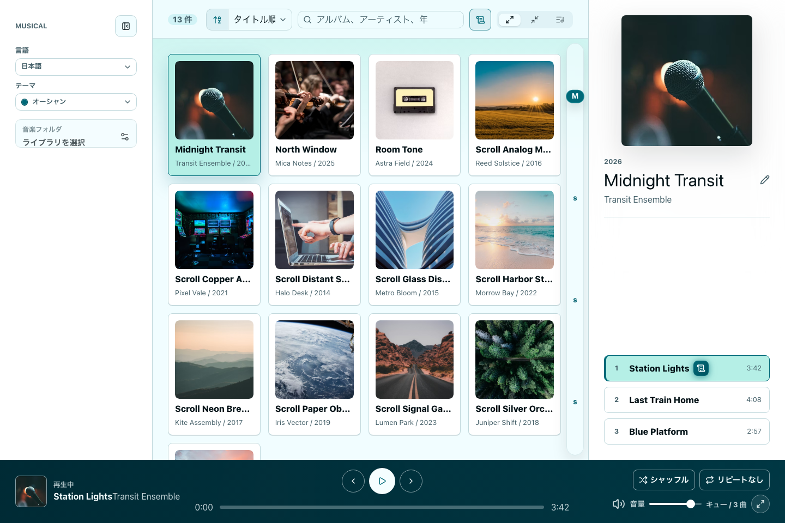
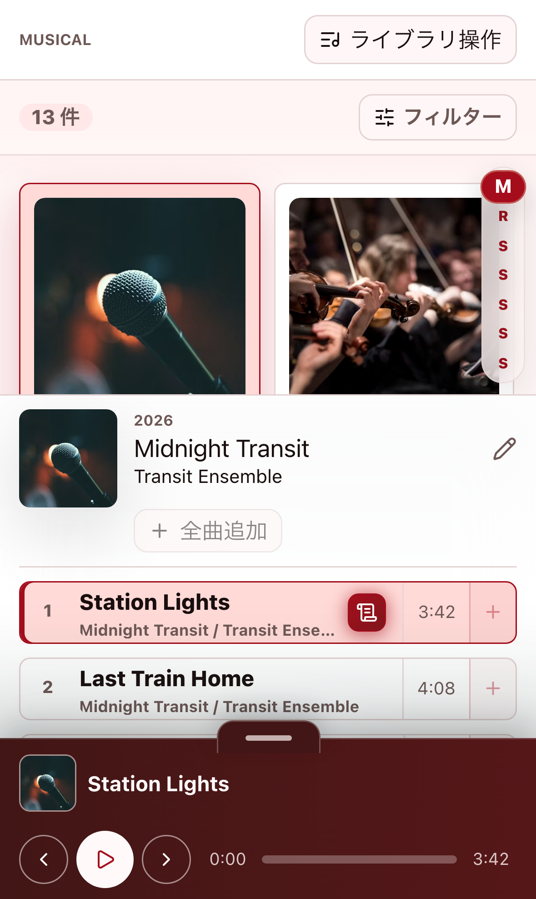
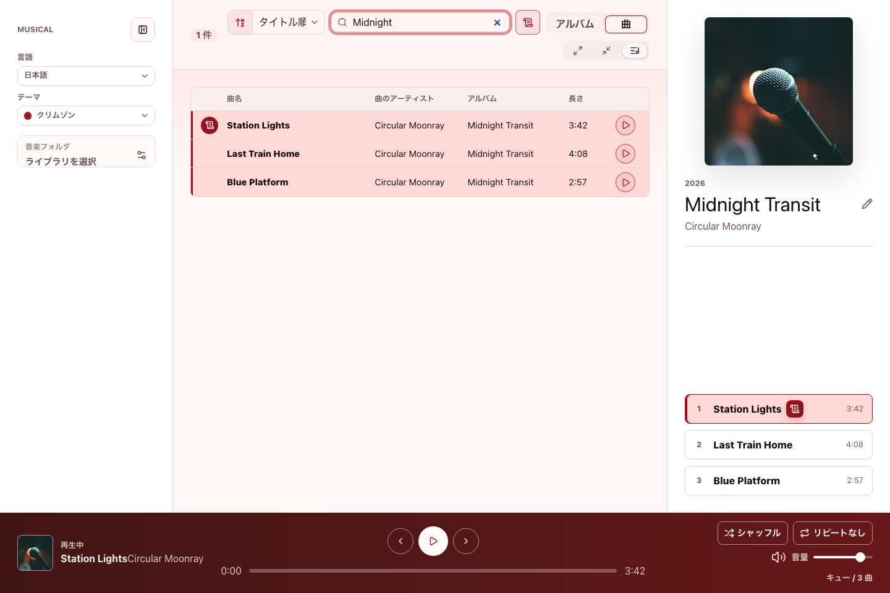
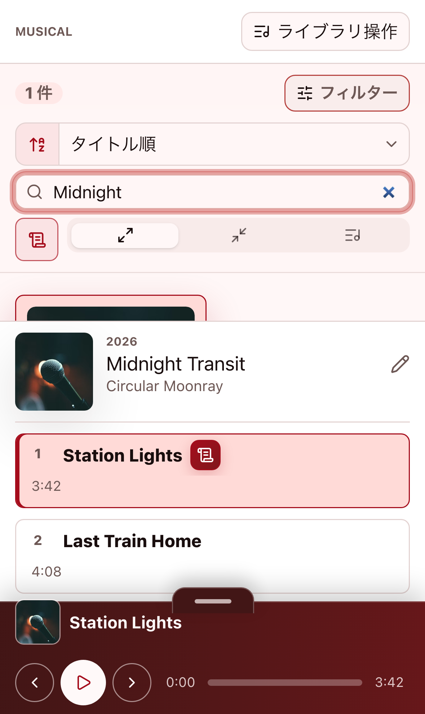
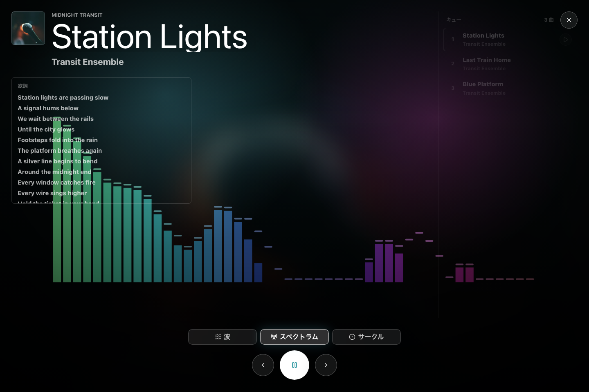
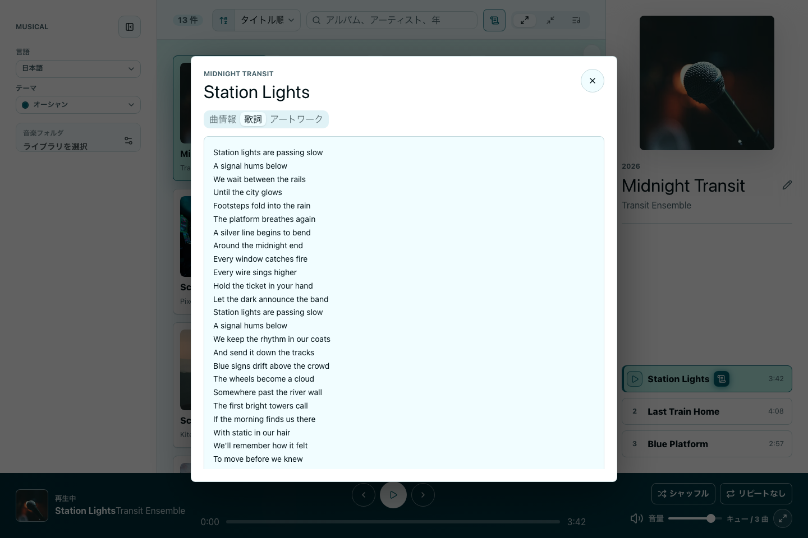

# Musical

**English:** [README.md](README.md)

Musical は、Windows / macOS / Linux で使えるデスクトップ音楽プレイヤーです。ローカルの音楽フォルダを読み込み、アルバム単位で整理しながら、再生、検索、タグ編集、歌詞確認、アートワーク編集までひとつの画面で扱えます。

## デスクトップでもスマホ幅でも見やすい画面

メイン画面はデスクトップアプリとして広い画面で使いやすいように作られています。狭い画面では、ライブラリ、選択中アルバム、プレイヤーが縦に並び、スマホ幅でも操作しやすい表示に切り替わります。

## できること

- ローカルの音楽フォルダをスキャンしてライブラリ化
- アルバムアートワークつきでアルバムを一覧表示
- アルバム名、アーティスト、年で検索
- 大アイコン、小アイコン、アルバム一覧、曲一覧の表示切り替え
- 再生、一時停止、前後の曲、シーク、音量、シャッフル、リピート
- アルバム名、アーティスト、年、ジャンルなどのタグ編集
- 曲ごとの歌詞表示
- アルバムアートワークの確認と差し替え
- 日本語 / 英語の表示切り替え
- 複数テーマの切り替え

## 対応環境

Musical は Tauri 製のデスクトップアプリとして、以下の OS での利用を想定しています。

| OS | 対応 |
| --- | --- |
| Windows | 対応 |
| macOS | 対応 |
| Linux | 対応 |

対応している主な音声ファイル:

- `mp3`
- `flac`
- `m4a`
- `mp4`
- `ogg`
- `opus`
- `wav`
- `aif`
- `aiff`

## アルバムを見つける

音楽フォルダを読み込むと、アルバム単位でライブラリが作られます。検索欄でアルバム名、アーティスト、年を絞り込み、表示モードを切り替えながら目的の音源を探せます。

曲一覧では、曲名、曲のアーティスト、収録アルバム、長さを横断的に確認できます。歌詞つきの曲だけに絞り込むこともできます。

## 再生する

アルバムや曲の再生ボタンからすぐに再生できます。画面下部のプレイヤーでは、再生 / 一時停止、前へ、次へ、シーク、音量、シャッフル、リピートを操作できます。

プレイヤーモードでは、再生中の曲をビジュアライザ、アートワーク、キュー操作、再生操作、保存済みの歌詞と一緒に大きく表示できます。

## 曲情報を見る・編集する

曲詳細では、曲情報、歌詞、アートワークをタブで切り替えて確認できます。デスクトップアプリでは、タイトル、アーティスト、アルバム、年、ジャンル、トラック番号、ディスク番号などのタグ編集と、アートワークの差し替えに対応しています。

## ライブラリを作成する

1. デスクトップアプリを起動します。
2. `音楽フォルダ` から読み込みたいフォルダを選択します。
3. `ライブラリを読み込む` を押します。
4. スキャン完了後、アルバム一覧と曲一覧が表示されます。

スキャン結果はローカルの SQLite データベースに保存され、次回起動時に読み込まれます。

## 開発者向け情報

セットアップ、開発コマンド、構成メモ、主なファイルは [docs/development.ja.md](docs/development.ja.md) にまとめています。

## ライセンス

MIT License. 詳細は [LICENSE](LICENSE) を参照してください。
