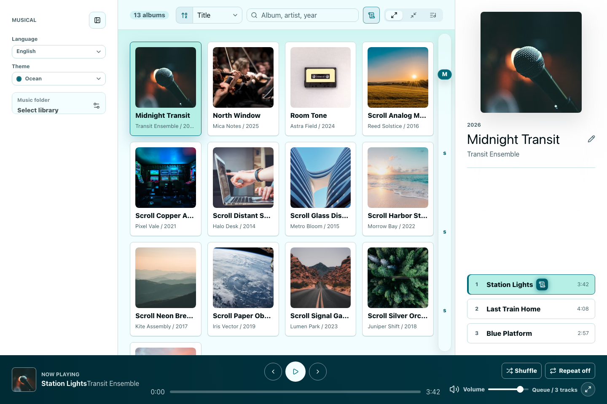
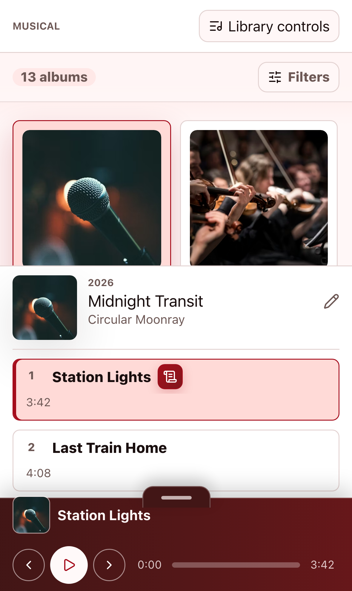
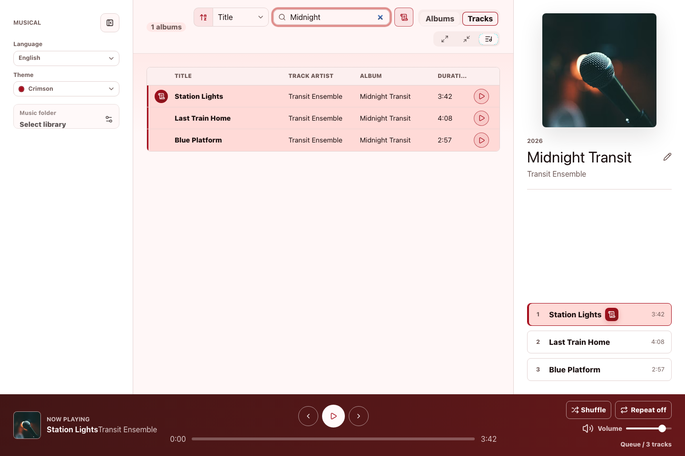
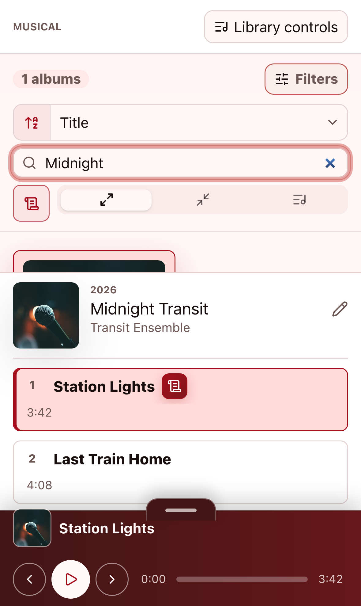
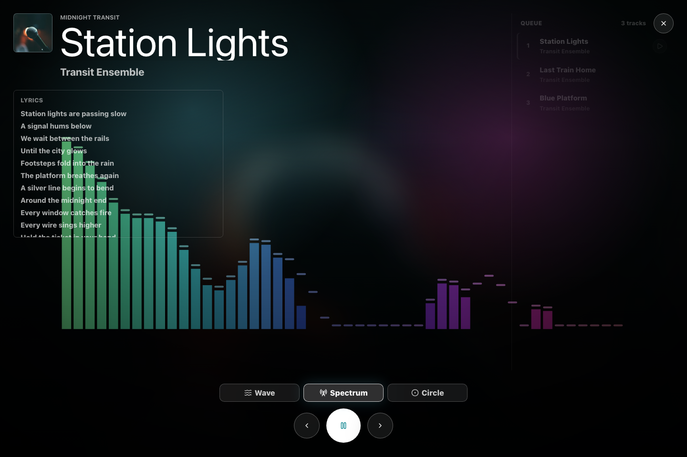
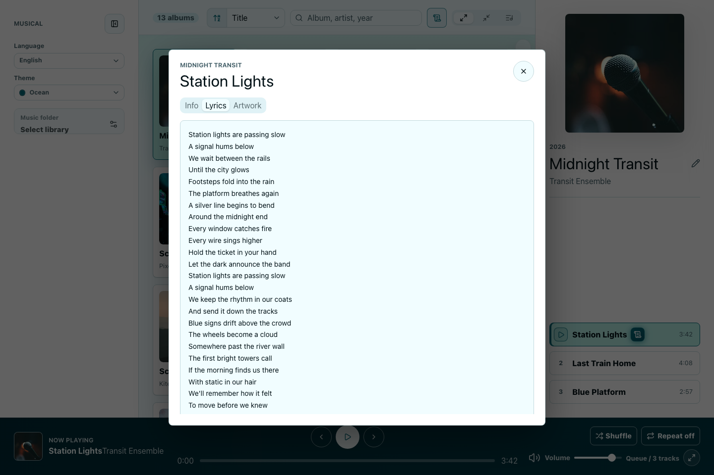

# Musical

**日本語版:** [README.ja.md](README.ja.md)

Musical is a desktop music player for Windows, macOS, and Linux. It scans a local music folder, organizes your library by album, and gives you playback, search, tag editing, lyrics, and artwork controls in one focused app.

## Desktop And Narrow Layouts

Musical is designed first as a desktop app, with a wide library view for browsing albums, tracks, and the current player at the same time. The interface also adapts to narrow widths, so the library, selected album, and player remain usable in a phone-sized preview or compact window.

## Features

- Scan a local music folder into an album library
- Browse albums with artwork
- Search by album, artist, or year
- Switch between large icons, small icons, album list, and track list views
- Play, pause, skip, seek, adjust volume, shuffle, and repeat
- Edit album and track tags such as title, artist, year, and genre
- View lyrics saved in tracks
- Review and replace album artwork
- Switch between Japanese and English
- Choose from multiple themes

## Supported Platforms

Musical is built with Tauri and targets desktop use on:

| OS | Support |
| --- | --- |
| Windows | Supported |
| macOS | Supported |
| Linux | Supported |

Common supported audio file types:

- `mp3`
- `flac`
- `m4a`
- `mp4`
- `ogg`
- `opus`
- `wav`
- `aif`
- `aiff`

## Find Albums And Tracks

After you load a music folder, Musical builds an album-based library. Use search and view modes to quickly find albums, artists, years, or individual tracks.

The track list shows song title, track artist, album, and duration across the library. You can also filter to items that include lyrics.

## Play Music

Start playback from an album or individual track. The player at the bottom of the app handles play / pause, previous, next, seek, volume, shuffle, and repeat.

Player mode expands the current song into a visualizer with artwork, queue controls, transport controls, and synced access to saved lyrics.

## View And Edit Track Details

Track details include info, lyrics, and artwork tabs. In the desktop app, you can edit title, artist, album, year, genre, track number, disc number, and artwork.

## Create A Library

1. Start the desktop app.
2. Select the local folder you want to load from `Music folder`.
3. Press `Load library`.
4. After scanning finishes, Musical shows your albums and tracks.

Scan results are stored in a local SQLite database and loaded again the next time the app starts.

## Developer Information

Development setup, commands, architecture notes, and source file pointers live in [docs/development.md](docs/development.md).

## License

MIT License. See [LICENSE](LICENSE) for details.
