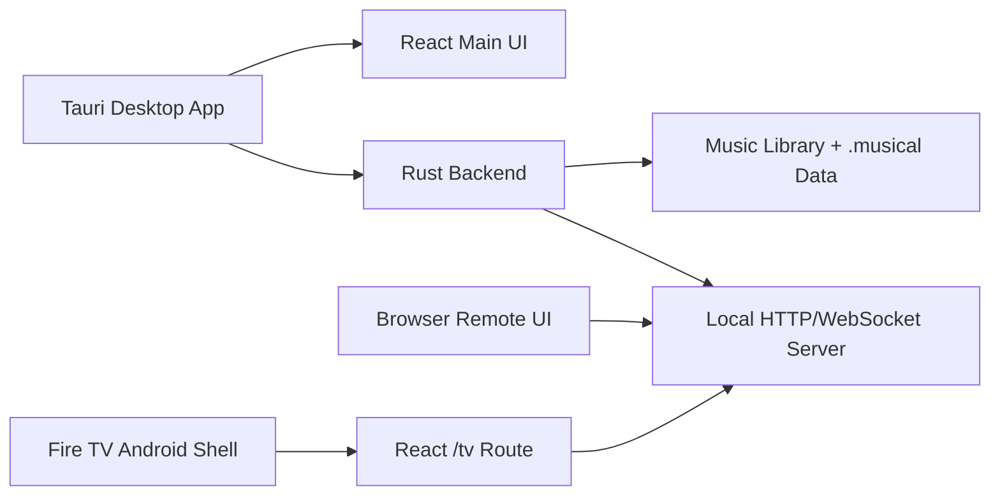
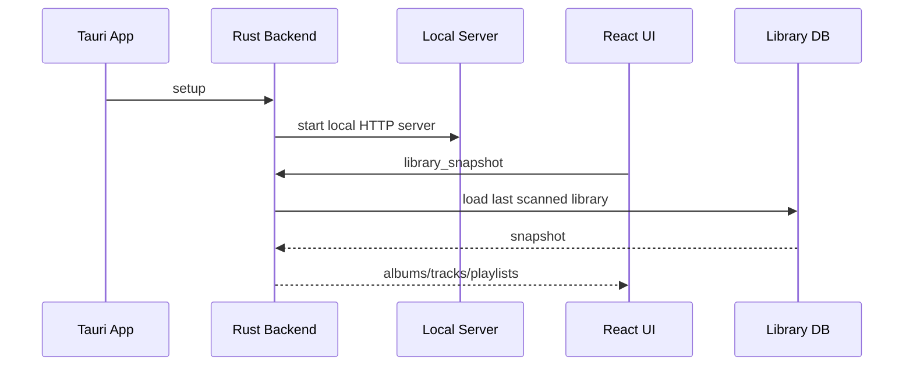
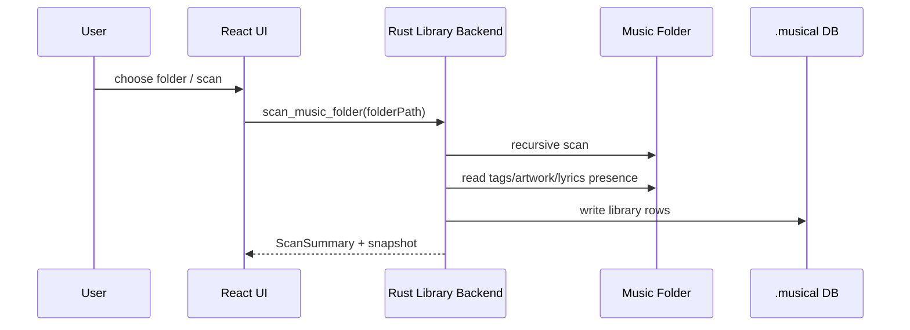
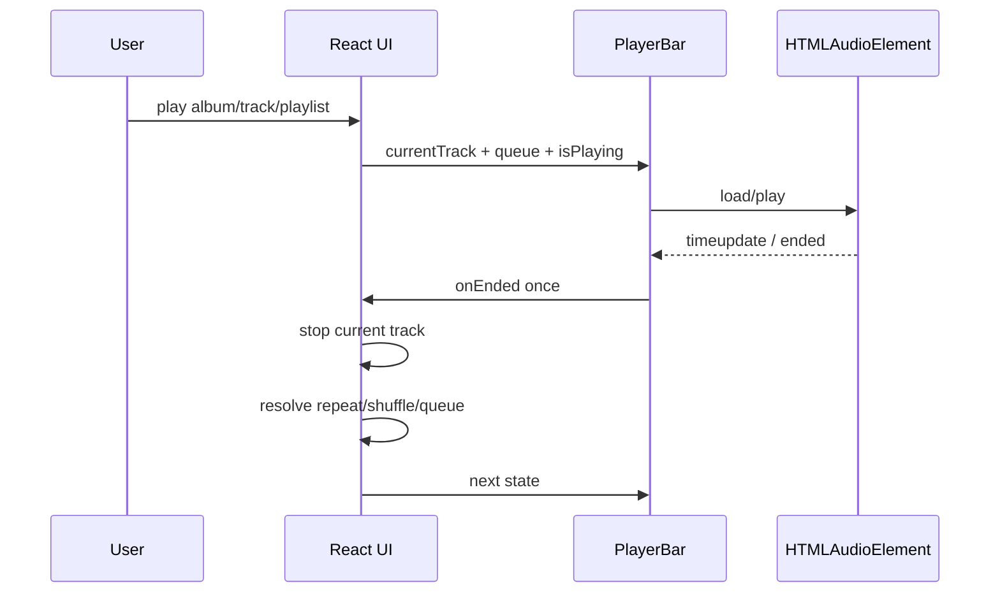
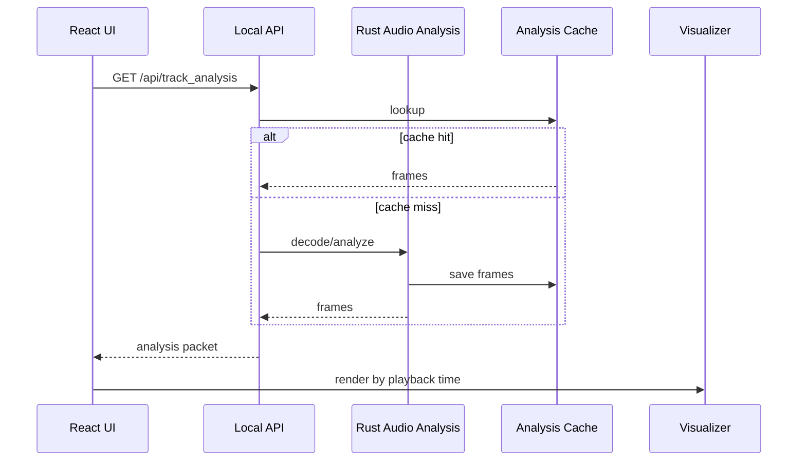
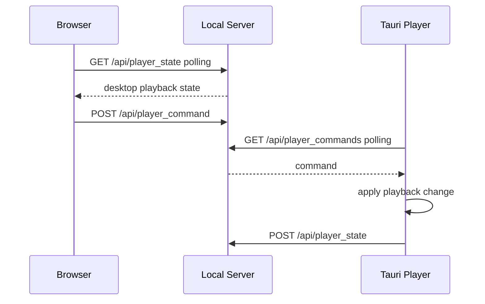
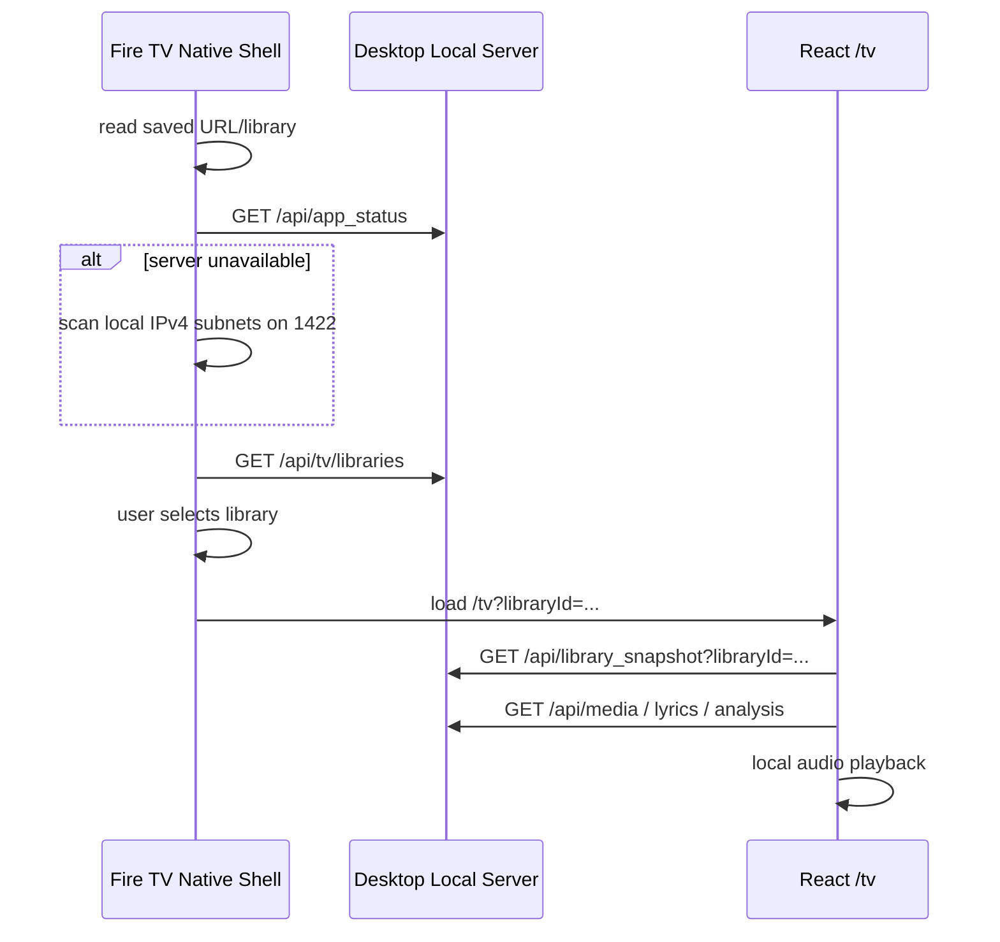

# Musical 基本設計書

この文書は、現在の仕様とコードから見た Musical の基本設計をまとめたものです。
実装変更時は、該当するコード、仕様、機能一覧、基本設計の差分が一致するように更新します。

## 1. システム概要

Musical はデスクトップ音楽プレイヤーを中心に、ブラウザリモート操作と Fire TV 表示を持つローカルファーストなアプリケーションです。

中心責務:

- Desktop app: ライブラリ管理、実音声再生、編集、ローカルサーバー公開。
- Browser app: mock 検証、または desktop backend への remote control。
- Fire TV app: テレビ向け UI と WebView audio によるローカル再生。
- Rust backend: スキャン、DB/ファイル操作、タグ/アートワーク更新、音声解析、local API。

## 2. ランタイム構成

| ランタイム | 実装入口 | 役割 |
| --- | --- | --- |
| React main UI | `src/App.tsx`, `src/app/AppShell.tsx` | デスクトップ/ブラウザ共通 UI |
| React feature hooks | `src/features/**` | library, playback, remote-player, tag-editing, tv-display の責務分割 |
| Tauri backend | `src-tauri/src/lib.rs` | Tauri command と plugin setup |
| AI test Tauri app | `src-tauri/tauri.ai-test.conf.json`, `scripts/ai-init-test.mjs` | Mockデータによる分離起動確認。非表示・非フォーカスでバックグラウンド実行し、frontendは`1430`を使い、local server、MCP sidecar、dev browserは起動しない |
| Library backend | `src-tauri/src/library.rs`, `src-tauri/src/library/**` | scan, snapshot, playlist, tag, artwork, storage |
| Audio analysis backend | `src-tauri/src/audio_analysis.rs` | FFT bucket 生成と cache |
| Local server | `src-tauri/src/local_server.rs` | `/api/*`, `/tv`, WebSocket, media streaming, MCP sidecar lifecycle/proxy |
| MCP sidecar | `src/mcp/**`, `dist/mcp/server.js` | MCP SDK server, AI SDK V7 compatible tool catalog, internal bridge client |
| Semantic search index | `src-tauri/src/search_index.rs`, `.musical/search_index.sqlite3` | ローカル multilingual embedding、歌詞 chunk、永続 vector cache、warm in-memory search |
| Lyrics sentiment analyzer | `src-tauri/src/lyrics_sentiment.rs`, `.musical/search_index.sqlite3` | Lindera/IPADIC形態素解析、日本語極性辞書、block/曲集約、coverage付き派生cache |
| Fire TV shell | `apps/firetv/app/src/main/java/app/musical/firetv/**` | Android native shell, discovery, Settings, key bridge |
| TV route | `src/features/tv-display/presentation/TvDisplayApp.tsx` | Fire TV/TV browser UI |

## 3. レイヤ設計

### 3.1 React Main UI

`AppShell` は controller から受け取った状態と handler を UI component へ配線します。

主な component:

- `LibrarySidebar`: ライブラリ、設定、テーマ、リモートアクセス導線。
- `AlbumBrowser`: アルバム/曲/プレイリストの一覧、検索、ソート、再生入口。
- `SelectedAlbumPanel`: 選択アルバムの曲、タグ編集導線、詳細表示導線。
- `SelectedPlaylistPanel`: プレイリスト曲の表示、追加、削除、並べ替え。右パネルはコンパクトなアートワーク/概要ヘッダーと64px以上の曲行を使い、曲名を2行まで確保する。歌詞と再生時間だけを常時表示し、元アルバム表示、上下移動、削除は曲ごとの操作メニューへ格納する。プレイリスト切替時はパネルのスクロール位置を先頭へ戻す。曲削除と再読み込みは対象プレイリストだけをバックエンドから再取得して差し替え、全 `LibrarySnapshot` を適用しない。
- `PlayerBar`: 再生状態、キュー、シーク、音量、Player mode 導線。キューは可変幅オプションから分離し、Player mode入口はグリッド自動配置から外してPlayerBar右端へ固定する。通常幅、Tauriの1226×768前後、タブレット、モバイルで常時表示し、キュー領域には入口とフォーカス外枠分の右余白を確保する。入口は明示的なaccessible name、キーボード操作、可視の `focus-visible` 外枠を持つ。開発版では現在曲の変更時に Performance API の measure entries が50万件以上か確認し、上限到達時だけ消去する。
- `PlayerVisualizerOverlay`: Player mode、ビジュアライザ、歌詞、キュー。
- `TrackDetailDialog`: 曲情報、歌詞、アートワーク候補検索、アートワーク、タグ編集。
- `ArtworkCandidateDialog`: MusicBrainz / Cover Art Archive 由来の候補検索、検索中の進捗表示、候補比較、preview、保存導線。

`src/features/**` は UI から切り出した領域別ロジックです。

- `library`: library selection と Tauri repository。
- `playback`: queue resolution、preferences、HTML audio、Media Session。
- `remote-player`: remote command、remote playback clock、analysis sync。
- `tag-editing`: album/track tag、artwork、user state 更新。
- `tv-display`: TV display message と `/tv` UI。
- `ui-interactions`: mobile/touch gesture。

### 3.2 Tauri/Rust Backend

`src-tauri/src/lib.rs` は Tauri command を定義し、Rust の各 module へ委譲します。

主な command:

- `library_snapshot`
- `scan_music_folder`
- `track_lyrics`
- `track_lyrics_analysis`
- `create_playlist`
- `add_track_to_playlist`
- `add_tracks_to_playlist`
- `rename_playlist`
- `delete_playlist`
- `remove_playlist_track`
- `reorder_playlist_track`
- `create_playlist_from_album`
- `update_album_tags`
- `update_track_tags`
- `search_artwork_candidates`
- `preview_artwork_candidate`
- `update_album_artwork`
- `update_track_artwork`
- `update_playlist_artwork`
- `update_track_user_state`

Backend の永続化方針:

- ライブラリ DB と解析 cache はライブラリ配下の `.musical` に置く。
- ライブラリと cache を音源ファイルと一緒に持ち運べるようにする。
- app process 内だけで十分な remote state は in-memory に保持する。

### 3.3 Local HTTP/WebSocket Server

Tauri setup 時に local server を開始し、desktop/browser/Fire TV の接続点になります。

主な API:

- `GET /api/app_status`
- `GET /api/library_snapshot`
- `GET /api/tv/libraries`
- `GET /api/track_lyrics`
- `GET /api/track_lyrics_analysis?trackId=...`
- `POST /api/track_lyrics_analysis` body `{ trackId }`
- `GET /api/track_analysis`
- `GET /api/track_analysis_bytes`
- `GET /api/media`
- `GET /api/player_state`
- `POST /api/player_state`
- `POST /api/player_command`
- `GET /api/player_commands`
- `POST /api/tv/player_event`
- `GET /api/mcp-settings`
- `POST /api/mcp-settings`
- `POST /api/_mcp/tools/{toolName}` internal bridge, loopback + token only
- `POST /mcp` MCP sidecar proxy, loopback only
- `GET /tv`
- `GET /tv/sessions/{sessionId}` WebSocket

アクセス制御:

- local request は許可する。
- LAN access が明示的に有効になるまで非ローカル request は拒否する。
- `/mcp` と `/api/mcp-settings` は LAN access と独立して local-only のままにする。
- MCP enabled 時、Tauri は `dist/mcp/server.js` を Node sidecar として起動し、`/mcp` request を sidecar の loopback port へ proxy する。
- MCP sidecar は `@modelcontextprotocol/sdk` の Streamable HTTP server を使い、AI SDK V7 `@ai-sdk/mcp` client から `mcpClient.tools()` / `callTool()` で検証する。
- `dev:public` は Vite 起動前に MCP sidecar を build し、production build は Vite が `dist` を生成した後に `dist/mcp/server.js` を出力する。これにより Vite の出力 cleanup で sidecar が欠落しないようにする。
- local server のrelease buildは `dist` を実行ファイルへ埋め込み、自己完結したWeb UIを配信する。debug buildだけは各frontend requestでworkspaceの現在の `dist` を優先し、`Cache-Control: no-store` を付ける。これにより長時間動作する `tauri dev` がCargo compile時点の古いvisualizer chunkをWeb/LAN側へ配信し続けることを防ぐ。disk buildがない場合は埋め込みbundleへfallbackし、`/api/*`、音声解析packet、remote player同期の経路は変更しない。
- MCP internal bridge API は sidecar に渡した per-process token (`X-Musical-MCP-Token`) を要求する。
- 初回の自動または明示的な index build は `intfloat/multilingual-e5-small` のcommit `614241f622f53c4eeff9890bdc4f31cfecc418b3`から必要5fileだけをアプリcacheへ取得する。各fileのsize/SHA-256とmanifest identityをmodel初期化の前後に検証し、FastEmbed用refを同commitへatomic固定してから、metadata documentと6行単位・2行overlapのlyrics chunkを埋め込む。embedding model IDはartifact identityに加えて、exact pinしたFastEmbed 5.17.4とtokenizers 0.22.2、mean pooling、max length 512、E5のquery/passage prefix、pool後のL2正規化を表すpipeline IDを含み、いずれかの世代変更で旧indexを無効化する。
- FastEmbed 5.17が`HF_HOME`を明示cacheより優先するため、`HF_HOME`設定中は共有Hugging Face cacheへrefを書かずsemantic model初期化をerrorにする。Musical専用application cacheを使うには`HF_HOME`未設定でMusicalを起動する必要があり、通常launcherが設定済みの値を解除することはない。
- search index は library database と分離した再生成可能な SQLite cache とし、各 library root の `.musical/search_index.sqlite3` に保存する。OS固有の区切り文字を連結せずpath APIで配置するため、Windows/macOSで同じ相対構造とする。
- library snapshotの初回読込み、folder scan完了、track/album tag更新、favorite/rating更新は、重複排除されたbackground refreshを予約する。手動 `build_search_index` と自動refreshは同じbuild lockで直列化し、document hash、embedding model ID、index schema versionが一致するembeddingを差分再利用する。SQLite busyや一時I/Oでrefreshが失敗した場合も、state lock解放後に61秒開始・最大1時間の指数backoffでin-memory retryを予約し、busy loopや次のlibrary mutation待ちにしない。background/手動buildの成功または明示的なforce/library mutationでfailure streakをresetする。
- 保存済み歌詞の感情解析はembedding documentと分離する。CRLFをLFへ統一し、空行の連続をstanza境界として、6非空行を超えるstanzaだけを6行ずつの非overlap blockへ分ける。解析用copyをNFKC正規化し、source順と1-basedの開始/終了行を保持するため、semantic embedding用の6行・2行overlap chunk規則は変えない。
- search index metadataはembedding model IDに加えてanalyzer ID、retryable感情件数、retry時刻を保持する。analyzer ID不一致と歌詞本文を含むsource revision不一致はbackground rebuild対象とし、旧semantic indexは検索可能なまま保持するが、analyzer ID不一致中は旧感情値をscoreへ混合しない。retryableな`unknown`は辞書失敗cooldown終了後にsingle-flight refreshへ1回だけ再投入する。
- exact pinしたLindera/lindera-dictionary/lindera-ipadic 5.1.0とembedded `mecab-ipadic-2.7.0-20250920`、unicode-normalization 0.1.25から基本形・品詞・NFKC解析copyを得て、名詞・動詞・形容詞・副詞を対象にする。crate versionとIPADIC artifactのMD5/SHA-256をanalyzer IDへ含め、pipeline世代変更時に旧analysis cacheを無効化する。東北大学 乾・岡崎研究室の`wago.121808.pn`と`pn.csv.m3.120408.trim`は初回利用時に公式HTTPS URLからapplication cacheへsingle-flightで取得し、固定SHA-256検証後にatomic保存する。raw辞書は配布物へ同梱しない。取得・hash・parse失敗は診断付き`unknown`へ縮退し、search index全体の失敗にしない。
- 感情scoreはpositive/negative tokenだけを分母とし、neutral/eはmatched coverageに含める。blockと曲はscored token数で加重平均し、coverageを`matched / eligible`、scoredが0件ならscoreなしの`unknown`とする。schema v2は`track_lyrics_sentiment`と`lyrics_sentiment_blocks`を独立tableとして追加し、library DBを変更しない。
- `search_tracks` は semantic score と簡易 lexical score を統合でき、`recommend_tracks` は自然言語の気分、再生時間、artist diversity、お気に入り、rating、genre、除外曲を扱う。queryも同じ感情analyzerで解析し、感情weightはsearchが既定`0`、recommendationが既定`0.15`、許容範囲は`0..=0.3`とする。query/曲双方にscoreがある場合だけ、`similarity = 1 - abs(query - track) / 2`、`effectiveWeight = requestedWeight * min(queryCoverage, trackCoverage)`、`final = base * (1 - effectiveWeight) + similarity * effectiveWeight`で混合する。weight `0`、coverage `0`、辞書取得不能時は既存base scoreとsort順をbit-for-bitで維持する。
- 音声向けMCPは`search_lyrics_by_mood`（read）と`play_lyrics_by_mood`（playback）を分ける。両toolは`hybrid`、lyrics target、lyricsOnlyで検索し、`moodStrength`を既存valence sentiment blendでは`0.08`、`0.15`、`0.30`へ、grief theme correctionでは`0.08`、`0.14`、`0.20`へ別々に写像する。strongのlow-specificity追加減点は最大`0.12`で、voice schemaへ`sentimentWeight`を公開しない。相対指定はremote player stateのcurrent trackを参照し、同値、`+0.25`、`-0.25`を`-1..=1`へclampした感情targetと元曲のcoverageをrankingへ渡す。play toolは候補検索からqueue確定までをserver operationとして実行し、成功時だけ先頭曲から再生する。index未準備、current track不在、参照感情なし、候補なしは構造化statusで返し、index未準備時はbuild/model downloadもqueue変更も行わない。音声応答は短い歌詞抜粋とcompactな感情summaryに限定する。
- `search_lyrics_by_mood` / `play_lyrics_by_mood` のtopic-aware処理は、promptがgrief、悲哀、哀歌、追悼、死別等を明示するか、loss/separation（喪失、別れ、さよなら等）とsorrow（涙、悲しみ、孤独等）の両方を含む場合だけ発火する。単なる「悲しい歌」、generic mood、`relativeToCurrent`には適用しない。複数blockかつ複数の証拠familyでcoreが成立した場合だけ正加点し、core未達はhard rejectせず正加点を行わないが、anti-themeとlow-specificityの上限付き減点は許容する。grief voiceの2 toolだけは同一lyrics hashまたは高いcontent containmentの別音源を1結果へ集約し、boundedにoversampleした候補pool内で可能な範囲だけ別候補を補充する。極端に重複が多い場合は結果が指定limit未満になり得る。generic検索は重複を保持する。正確な曲名・artistを`search_library` / `play_search`へ振り分ける規則、既存の歌詞感情解析とsemantic index cacheは変更せず、DB schemaやembedding indexのrebuildは行わない。比喩中心・語彙の少ない歌詞では決定論的heuristicの精度が限定され、exactな8曲構成は保証しない。
- strong悲哀指定では、喪失の具体性と悲哀証拠blockの占有率がともに低いsemantic false positiveだけへ上限付きlow-specificity減点を適用する。全面的な物語分類やC評価の排除保証には使わず、S/A/B相当の特徴が重なる候補を保護する境界を設け、hard rejectしない。near-identical dedupeはlyrics hash、行containmentに加え、十分長く長さの近い正規化全文の5-character gram containmentを用いて句読点、空白、表記揺れを吸収する。この追補もgeneric mood、`relativeToCurrent`、公開schema、DB/index cacheを変更せず、決定論的heuristicの限界を引き継ぐ。
- block/曲分析はTauri command `track_lyrics_analysis`、`GET` / `POST /api/track_lyrics_analysis`、MCP read tool `get_track_lyrics_analysis { trackId }`で取得する。cacheがなければ保存歌詞をon-demand解析し、曲不在、歌詞なし、index不在、辞書利用不能をpanicさせず結果または診断として返す。
- 検索時は永続 embedding をプロセス内へ generation 単位で warm load し、query embedding は bounded LRU cache で再利用する。MCP sidecar は検索 cache を所有しない。
- Tauri は MCP sidecar の stdin pipe を保持し、sidecar は pipe の EOF を親プロセス終了として扱って即時終了する。これにより Tauri の異常終了時にも orphan Node process を残さない。
- media は server が公開した file/API 経由でのみ取得できる。
- アートワーク候補検索と候補画像 download は Tauri command 専用で、local server API には公開しない。

### 3.4 Fire TV Android Shell

Fire TV app は Android/Kotlin native shell と WebView の組み合わせです。

Native shell の責務:

- explicit intent/deep-link display URL を解決する。
- 保存済み server/library/locale を SharedPreferences で保持する。
- local IPv4 subnet の port `1422` を probe し desktop server を検出する。
- `/api/tv/libraries` を読み、Settings に server/library candidates を表示する。
- native tabs: Settings, Albums, Tracks, Player を表示する。
- DPAD、Enter、media keys、number keys、Back を WebView または native shell 操作に変換する。
- WebView lifecycle、splash、status、exit confirmation、memory diagnostics を管理する。
- WebView automatic darkening を無効化する。

WebView `/tv` の責務:

- library snapshot、lyrics、media、analysis を local server から取得する。
- Albums/Tracks/Player の TV surface を描画する。
- WebView `<audio>` で Fire TV local playback を行う。
- TV visualizer を 30 fps 上限で描画し、古い frames は decay/clear する。
- WebSocket session がある場合は display messages を適用する。

## 4. データモデル概要

### 4.1 Library

- Album: id, title, album artist, year, genre, artwork, tracks。
- Track: id, title, artist, duration, track/disc number, file path, lyrics presence, favorite, rating。
- Playlist: id, name, artwork, ordered track paths, resolved tracks, missing tracks。

### 4.2 Playback

- `currentTrack`
- `playbackAlbumId` / playback album context
- `playbackPlaylistId` / playback playlist context
- `playbackQueueTrackIds`
- `isPlaying`
- `isShuffle`
- `repeatMode`: `off`, `all`, `one`
- `currentTime`
- `volume`

### 4.3 Audio Analysis

- Analysis packet は track id、frame interval、frames、complete flag を持つ。
- Frame は time, frequency bands, peak, rms を持つ。
- Frontend は再生時刻の周辺 frame を補間して描画する。
- Fire TV は短い analysis window を繰り返し取得する。

### 4.4 TV Display

- `TvDisplayEnvelope` が session id、sentAt、message を包む。
- message は session snapshot、player state、lyrics state、queue state、analysis packet、command result、candidate prompt、session close を扱う。
- direct `/tv?libraryId=...` flow では HTTP polling も併用する。

## 5. 主要シーケンス

### 5.1 デスクトップ起動

### 5.2 ライブラリスキャン

### 5.3 再生と曲終了

### 5.4 ビジュアライザ解析

iTunes由来の `ID3v2 + RIFF/RMP3` wrapper は、ID3 header の syncsafe size からタグ終端へ seek し、`data` chunk 以降をMP3としてprobeする。ブラウザ側の解析取得が一時失敗した場合は上限付きbackoffで再試行し、停止・曲変更時に再試行を解除する。

音声解析は曲単位でEOFまで実行し、音声stream MD5、file path、modified time、track UUID、analysis versionが一致する完全cacheだけを再利用する。APIは任意durationの部分解析を持たず、要求長をcache validityへ含めない。フロントエンドは曲全体のcompact bytesを1回取得し、JSONをfallbackとする。

`PlayerVisualizerOverlay` は解析 bucket を共通入力として、波、スペクトラム、サークル、山脈、カラーフロー、VU メーターを Canvas 2D で描画する。カラーフローは周波数域を5ブロックへ分け、各ブロックを中央へ集まる1つの大きな半透明の雫として描く。ブロック内の周波数値の正規化合計をattack 0.16秒、release 0.48秒の時定数で平滑化し、低いenergyも非線形に持ち上げて、対応する雫の大きさ、縦横比、中心位置を音楽に追従させる。輪郭は複数の低周波な周期成分を合成した18点の閉曲線として滑らかに変形する。外側はalphaをゼロへ落とした広いhalo、内側は弱いblurと低輝度の細い外周で形を読める半透明面として描き分け、隣接するブロックの接触部だけに短いレンズ状の半透明膜を加える。中央へ集まる小光点、点状の接点光や直線状の境界ハイライトは描かない。内部モードID `ink` は保存済み設定との互換性のため維持する。オーロラ、スターフィールド、DNA 螺旋、ワープホールはそれぞれ専用の Three.js/WebGL2 canvas で GLSL シェーダーを実行し、WebGL 初期化に失敗した場合だけ Canvas 2D 描画へ fallback する。ちびキャラオーケストラは通常のモードボタンへ出さず、Chibi mode ボタンのダブルクリック/ダブルタップで一時的に切り替える。山脈は下端へ閉じる面の起伏として遠景から近景へ描き、最前景だけは加算 glow の後に `source-over` の面と稜線を最後に重ねる。

Player mode の画面 module はアプリ起動直後の effect で非同期に事前ロードし、選曲や入口操作を待たず ready 状態へ反映する。現在曲の歌詞も選曲時に非同期取得し、Player mode を開く操作からデータ取得を分離する。取得済み module の component を直接描画し、`React.lazy` の初回解決による余分な Suspense fallback を挟まない。Player mode の開閉 state は `PlayerExperience` 内へ隔離し、開閉時に library controller とライブラリ全体を同期再描画しない。押下時は軽量な全画面 shell を同期表示し、2回の `requestAnimationFrame` 後に実体を mount することで、重い描画初期化より先に少なくとも1フレームの操作応答を描画する。事前ロード未完了時の shell は閉じる操作と `aria-busy` を維持する。Canvas、音声解析、描画 loop などのビジュアライザ実体は Player mode を開いて component が mount された時に初めて生成する。Player mode 本体には Canvas 2D fallback だけを含め、Three.js/WebGL の4実装は対象モードの選択時に dynamic import する。Chibi、spectrum、orchestra、surf の画像URL群と画像デコードも対象表示が有効になった時まで遅延し、アプリ起動時や通常の Player mode 初回表示で全画像をロードしない。

Player mode入口は、共通buttonのリップルとactive時の移動・scaleを使用しない。通常位置の `translateY(-50%)` を押下中も維持し、transitionを持たない色・枠・focus-visibleだけの静的フィードバックとする。

macOS の `cargo run` はworkspaceのCargo runnerを介し、`target/debug/musical` をコピーせず開発専用 `.app` 内の実行ファイルsymlinkから起動する。これにより `tauri dev` の監視・終了管理と実バックエンドを維持しながら、実行中プロセスをLaunchServicesとUI automationから一意に識別できる。実機開発版は `com.circularmoonray.musical.dev`、分離したAIテスト版は `com.circularmoonray.musical.ai-test` を使用する。wrapperは `target/codex-dev-apps/` に生成し、製品bundleやrelease実行ファイルは変更しない。

開発用Cargo profileはアプリ本体にline-table相当のdebug情報を残し、依存crateのdebug情報を無効にする。`npm run tauri -- ...` とWindows開発ランチャーの起動前には `src-tauri/target` の総容量を確認し、既定8 GiB（`MUSICAL_BUILD_CACHE_LIMIT_GB` で変更可能）を超え、かつworkspaceのMusicalが実行されていない場合だけ `cargo clean` を実行する。手動確認は `npm run cache:status`、明示的な削除は `npm run cache:prune` を使う。

overlay の stacking context はブラウザ間で同じ合成結果になるよう、アートワーク背景、装飾背景、Canvas、vignette、操作 UI、closeボタンの順を非負の `z-index` で明示する。Canvasと装飾レイヤーは `pointer-events: none` とし、closeボタンを常にクリック可能な最前面へ置く。Canvas 内部のピクセル検査に加え、overlay 全体の screenshot が再生中に変化することとcloseボタンでoverlayを閉じられることをブラウザ回帰テストで検証し、親背景の背面へ Canvas が隠れる不具合と透明レイヤーが操作を遮る不具合を検出する。

専用 WebGL canvas が利用できる間、基本の Canvas 2D canvas はモード移行時に一度だけ消去し、毎フレームの全面消去を行わない。WebGL の論理サイズは `ResizeObserver` で保持し、DPR が変わらないフレームでは layout 寸法を読み直さない。オーロラ、スターフィールド、ワープホールの全画面 post-processing は深度を使わないため renderer、composer、bloom の中間 target に深度 buffer を持たせない。DNA 螺旋はDPR上限1.0の単一描画パス、ワープホールはオーロラと同じDPR上限1.2の `RenderPass → UnrealBloomPass → OutputPass → highlight/alpha limiter` とする。周波数履歴、方向別エネルギー、palette は再利用 buffer へ書き込み、変更された uniform だけを GPU へ転送する。オーロラは音声解析処理と履歴の取得間隔を維持しながら、GPU の composer 描画だけを最大30 fpsへ制限する。DNA 螺旋とワープホールの GPU 描画は再生中を最大30 fps、低モーション時を最大18 fpsに制限し、idle は overlay 起動時の一回描画とする。live loop から inactive 描画を要求された場合も15 fpsを上限とする。ワープホールは20ブロックを格納する現在/過去各5 RGBA texelをfragmentごとに一度だけ取得し、カーテンから十分離れたfamilyのFBMとstrand評価を省略する。オーロラは選択中の配色側だけの FBM envelope を評価し、スターフィールドは presence または halo が厳密にゼロの星候補を後続計算から除外する。オーロラの Theme/レインボーとスターフィールドは最適化前の最終 RGBA とフレーム進行を維持し、オリジナル/アートワークだけは後述する霧調プロファイルの高輝度抑制を適用する。

ビジュアライザの control dock は、通常幅では10モードを1×10、4配色を1×4で上段へ横並びにし、再生操作を最下段に保つ。モードボタンは24×24の共通 viewBox と線幅を持つ専用 SVG で、波形、スペクトラムバー、放射円、山形、オーロラカーテン、放射状ワープ、二重螺旋、墨の渦、2連メーター、渦状のワープホールをそれぞれ表す。アートワーク配色はジャケットの縮小画像をボタンへ表示せず、画像枠と抽出色3点の SVG で「画像からの色抽出」を表す。幅680px以下ではモードを3列、配色を2×2へ戻す。外周余白、段間、ボタン寸法を抑え、overlay の残りの高さを `visualizer-stage` へ割り当てる。stage 内の歌詞とキューの配置は変更しない。PlayerBarではキューを可変幅オプションから分離し、Player mode入口をグリッド自動配置から外して右端へ固定することで、折り返しやWebKitの内在幅計算で重要操作を切り落とさない。

オーロラは解析 bucket を低域から高域まで5帯域へ要約し、横方向へ連続する色・エネルギーマップとして補間する。GPU シェーダーは5フレームの周波数履歴、FBM ノイズ、蛇行する発光上端、多数の縦フィラメント、半透明の面光、暗部へ溶ける不規則な下端を合成する。色は横方向のオーロラパレットに加え、上端の淡い色から下端の隣接色相へ移る縦グラデーションを持つ。レインボー選択時はライムからグリーン、アクア、ブルー、バイオレット、マゼンタ、ローズへ進む8色を左から右へ補間し、オリジナル選択時の寒色中心パレットと明確に区別する。オリジナルとアートワークは霧調プロファイルを使い、細い白い芯、露出、bloom を抑えながら低輝度の面光、カーテン周辺の拡散光、半透明の霞を残す。Theme は従来の非レインボー描画、レインボーは細線主体の形状、専用露出、専用 bloom を維持する。レインボーの解析履歴は約48 ms間隔で更新し、帯域エネルギーを上端位置、フィラメント長、輝度へ強く反映する。`EffectComposer` の `UnrealBloomPass` は高輝度の芯だけへ薄い bloom を加え、面全体の白飛びを避ける。Canvas 2D fallback でも霧調プロファイルでは加算合成の不透明度と白混合を下げ、面の blur を広げる。帯域の強度はフィラメントの丈、輝度、太さ、揺れへ反映する。DNA 螺旋は一定間隔で解析 bucket を周波数履歴へ取り込み、低音から高音へ分割した1時点のスナップショットを横線1本として扱う。専用 WebGL は8帯域×32履歴、Canvas 2D fallback は24帯域×42履歴を使う。どちらも新しい横線を下側、古い横線を上側へ配置する時間軸を維持し、GPU シェーダーは中央と左右の二重螺旋、その周囲の半透明な霧、帯域強度に反応する水平光条、250〜450個相当の流れる微粒子、40〜80本相当の短い尾、同時に2〜4本読める外向き波面を単一描画パスで合成する。低エネルギー時も最低輝度とコントラストを確保するが、粒子・波面の増幅源は固定ノイズではなく8帯域×32履歴のエネルギーと正の時間差分を使う。Canvas 2D fallback では従来の線描を使う。描画モードと配色モードは独立したボタングループで選択する。配色は旧来の時間変化する HSL 配色を再現するオリジナル、アプリテーマ、アートワークから抽出した代表色、固定レインボーから選択する。通常モードの選択値は `localStorage` へ保存し、`prefers-reduced-motion` が有効な場合は粒子数、回転、移動速度を抑制し、post-processing を使うモードでは bloom 強度も下げる。

DNA 螺旋のWebGL背骨は片側6本、横桟は3本の細い発光繊維束とし、単一の太いネオン線へ戻さない。各繊維は安定seedを持つ低周波wanderとfine flutterを合成し、8帯域のenergyと正のriseで揺れ幅と輝度を個別に変える。色はAuroraと同じ8 stopへ再標本化し、横桟の左から右を低域から高域へ対応させることで、RainbowだけでなくOriginal、Theme、Artworkでも選択palette全域を螺旋構造へ反映する。最終段は彩度1.18相当を維持した色相保存型highlight圧縮を行い、RGBを0.88、alphaを0.84以下へ制限して白・灰化を避ける。

ワープホールは画面中央よりわずかに左へ小さなほぼ黒い消失孔を置き、`log(radius)` による強い遠近圧縮で、8群以上の螺旋リボンを複数の奥行きから同じ消失点へ収束させる。
各リボン群は渦の周囲で位相と曲率をずらして識別可能にし、鋭い発光端から片側へ長く減衰する半透明のオーロラベールと柔らかなハローを重ねる。内部はカーテン座標を可変密度のcellへ分け、fragmentごとに最寄り3 cellだけを評価するprocedural filament/hair fieldを主形状とする。各cellの安定hashから低周波wander、中周波drift、細かなflutterを合成し、固定本数の太い線や規則的な点線ではなく、多数の独立した長い連続線として描く。全配色でAuroraと同じ細密フィラメント、幅の異なるfold、低〜中輝度の半透明な面光を親ベールへ重ねる。オリジナルとアートワークは面光を広く残すmist、Themeはstandard、レインボーは非線形な色進行と細線を強めたrainbowプロファイルを使う。白混合は細いcoreに限定し、レインボーでは彩度1.18相当、露出1.65以下、出力alpha 0.84以下の制御でライムからローズまでの発色を残す。
複数の画面端から入る前景流と位相をずらした内向きカールによって非対称な掃引を作る。
色は4配色ともAuroraと同じpalette変換を通し、8 stopへ再標本化して画面横方向の共有色相座標から参照する。これにより重なるfamily、hair strand、veilが近い色相を共有し、補色の加算で白・灰へ寄ることを避ける。RainbowはAuroraと同じ8色と非線形進行、Themeでは `--primary`、`--accent`、`--foreground`、アートワークでは画像抽出色、Originalでは寒色paletteを全面反映する。paletteまたは描画profileの変更時は描画fpsの間引き時間内でも直ちに1フレーム描画する。
20周波数ブロック×32履歴 texture の新しい行を外周、古い行を消失孔側へ対応させ、energy と正の時間差分を各リボン群と奥行きへ分散することで、音の立ち上がりが内側へ移動して見えるようにする。CPUは昇順21境界で解析bucketを20ブロックへ要約し、5 RGBA texel×32行の固定長DataTextureをin-place更新する。
20ブロックは0-based group `g=0..4` ごとに `g, g+5, g+10, g+15`（1-basedでは `1,6,11,16` から `5,10,15,20`）の飛び石集合へ分ける。集合energy/riseは4値のmeanとpeakを混合し、単一block pulseも残す。各親familyはcurtain座標を可変密度のcellへ分け、fragmentごとに最寄り3 cellだけを評価する。各cellは安定hashから固有の低周波wander、drift、flutter、濃淡、開始・終了深度、周波数groupを得る。密度自体にも長周期の揺れを加え、固定本数の太い線や周期的な等高線ではなく、集散しながら霞へ消える多数の独立した連続hairとして見せる。`fwidth`に基づく幅を0.015〜0.11 cellへ制限し、中心側の欠落と外周側の融合を避ける。消失孔の近傍ではfamilyごとの寄与を段階的に弱め、重なった細線が白い塊へ変わらないようにする。family間には低alphaの共通mistを残し、完全な黒い楔で幕を分断しない。全入力ゼロでは固定形状だけを残し、音声発光を生じさせない。
飛び石集合によるhair単位の反応に加え、20ブロックを低域1〜4、中低域5〜9、中高域10〜15、高域16〜20の4つの視覚役割へ要約する。各役割はenergyと正のriseを別々のattack/releaseで平滑化する。低域は消失孔の径、トンネルの捻れ、奥行き方向の進行速度を呼吸させ、中低域はveil、mist、family幅を厚くし、中高域はhairのwanderと集散を強め、高域は既存hairの芯とhalo上だけを細かく色付きで煌めかせる。立ち上がりは外周が新しく内周ほど古い32履歴の差分へ重ね、画面全体を同時にフラッシュさせず外周から消失孔へ光の波を運ぶ。新しい粒子、全画面の白パルス、大きな色相ジャンプは音声反応として追加しない。
旧来の横断放出線、ring rail、粒子、spike、starは無効化し、絹状の連続hair fieldとハローを主形状に保つ。
解析発光は `1 - exp(-radiance * exposure)` の exposure を1.65以下とし、Auroraと同じthreshold 0.34、Rainbow strength 0.31、radius 0.62のbloomを高輝度の細線へだけ加える。post bloomでは彩度の高い色を優先して残すsoft highlight compressionとalpha 0.84上限を適用し、無彩色の白飛びを抑える。
DPR上限1.2、全画面quad 1枚とcomposerを使い、既存の paused、idle、低モーション時の更新cadenceを維持する。固定長bufferを描画中に再利用し、終了時はhistory texture、composer、bloomを含むThree.js resourceを破棄する。
WebGL 初期化に失敗した場合は Canvas 2D で暗い中心と複数の螺旋を描く。

スターフィールドは画面中央付近の消失点から星を手前へ射出するワープ航行表現とする。GPU シェーダーは距離と速度の異なる5層の放射状光跡、中心付近の微細な星間ダスト、色付きのハロー、中心フレア、薄い衝撃波リングを合成する。周波数 bucket は32方向へ割り当てる前に、完全な32分割を列方向へ読む `1,33,65,2,34,66…` 型の順序へ並べ替える。これにより隣接する周波数値を角度方向へ散らし、特定帯域が強い場合も一方向だけへ光跡が偏ることを防ぐ。各方向の平滑化エネルギーは光跡の出現数、長さ、太さ、輝度を制御し、全体エネルギーと正の差分から求めた立ち上がり成分は一時的に光跡数、中心フレア、衝撃波、bloom を強める。停止時は平滑化済みエネルギーと立ち上がり状態をリセットし、音声連動光跡を残留させない。低域は加速度、中域は空間の霞、高域は微細星と瞬きにも反映する。`UnrealBloomPass` は光跡の芯だけを発光させ、背景の黒とUI文字の可読性を保つ。低モーション設定では移動速度、光跡長、衝撃波、立ち上がり反応、bloom 強度を抑える。

remote 解析 packet の `frameTimecodes` は昇順を前提とし、推定再生時刻以上となる最初の frame を lower-bound 二分探索で求める。探索後の前後 frame と補間係数は従来どおりとし、長い曲でもフレーム数に比例する毎描画走査を行わない。

### 5.5 Browser Backend Remote Control

### 5.6 Fire TV Direct Launch

## 6. UI 設計方針

- デスクトップ UI は広いライブラリ閲覧と下部 player を中心に構成する。
- 狭い画面ではパネル折りたたみ、長押し、縦スワイプなど mobile-style interaction を使う。
- Player mode は実再生状態を保ったまま full-screen overlay として開く。
- Fire TV UI は 10-foot UI として、視認性、remote focus、低負荷描画を優先する。
- Fire TV の色は modern CSS color functions と fallback color の両方で成立させる。
- UI copy は通常実装では English/Japanese locale のみ更新する。

## 7. エラーとフォールバック

- 解析失敗時も再生、キュー、Player mode を壊さない。
- Remote/offline analysis を優先する Tauri/同期ブラウザでは、再生中の HTML audio を Web Audio の `AudioContext` へ接続しない。これにより Windows WebView2 で suspended context が音声出力を止めることを防ぐ。remote frames が未取得なら idle 表示へ落とす。remote analysis を使わない直接ブラウザ再生だけは Web Audio analyser を fallback とする。
- Browser backend では Tauri native 機能を desktop-only として扱う。
- Fire TV server discovery に失敗した場合は fallback URL と Settings を表示する。
- 保存済み Fire TV library が見つからない場合は自動で先頭 library を選ばず、明示選択を待つ。
- Android WebView の forced dark / unsupported CSS color function により TV player が読めなくならないよう fallback を持つ。

## 8. テストと確認観点

変更内容に応じて次を選択して実行する。

- `npm run build`
- `cargo check`
- `cargo test`
- `VITE_MOCK_DATA=true npx playwright test tests/e2e/library.spec.ts -g "player mode"`
- Fire TV unit tests
- Fire TV debug APK / emulator / device 確認
- real Tauri/local backend での動作確認

重点確認:

- ライブラリスキャン、再読み込み、検索、ソート。
- 再生ボタンと曲終了シーケンス。
- シーク/曲変更時の analysis frame clear。
- Player mode と Chibi visualizer。
- Browser backend remote command の即時 UI 反映。
- Fire TV discovery、library selection、remote navigation、local playback、analysis window。

## 9. ドキュメント更新ルール

機能変更、仕様変更、UI/UX 変更、API/データ構造変更、ランタイム責務変更を行う場合は、コード修正と同じ変更セットで次を確認する。

- 機能棚卸しが変わる場合は `Specs/feature-list.md` を更新する。
- 基本設計や責務分担が変わる場合は `Specs/basic-design.md` を更新する。
- 詳細仕様が変わる場合は `Specs/current-platform-capabilities.md` と `Specs/current-platform-capabilities_JP.md`、または該当する `docs/*.md` を更新する。
- Fire TV protocol / architecture / UI design が変わる場合は `docs/firetv-*.md` を更新する。
- 再生終了、キュー、ボタン状態が変わる場合は `Specs/playback-sequences.md` を更新する。
- ビジュアライザの解析・描画挙動が変わる場合は `docs/visualizer-design.ja.md` を更新する。
