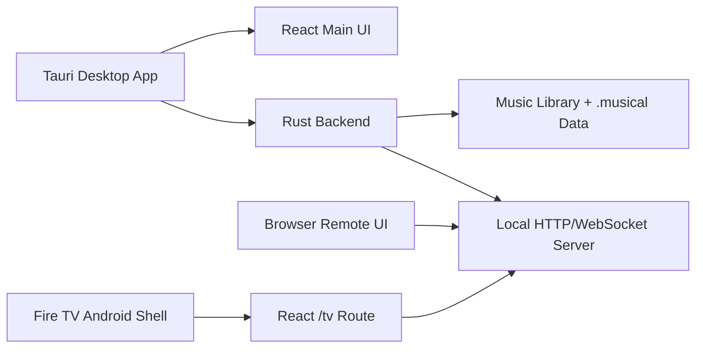
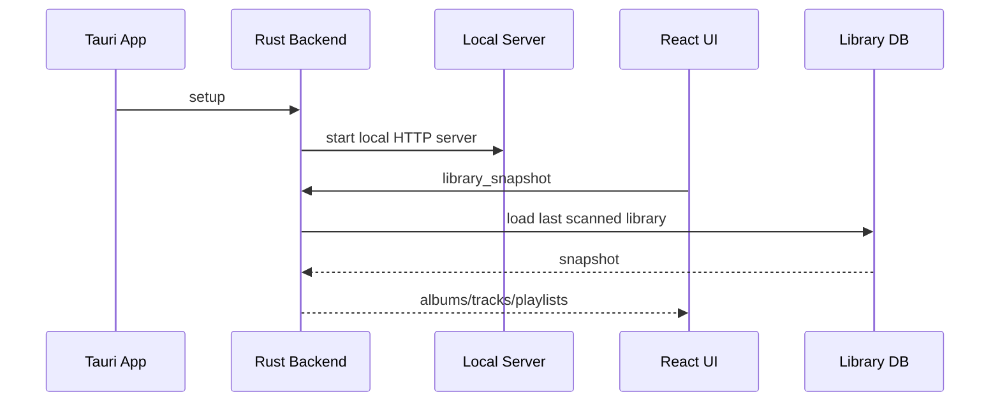
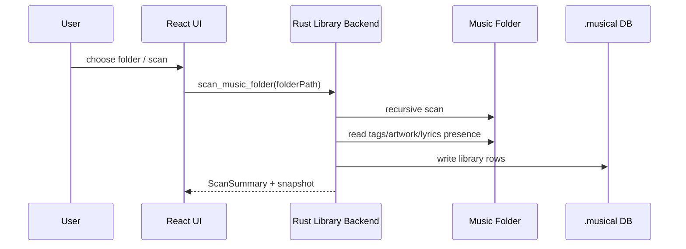
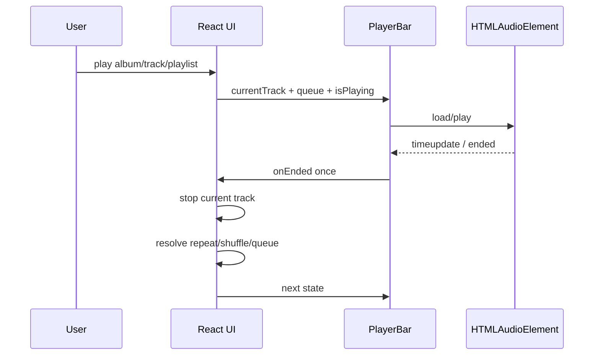
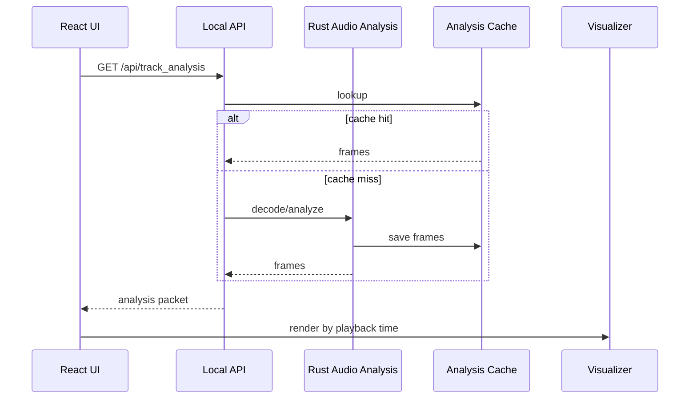
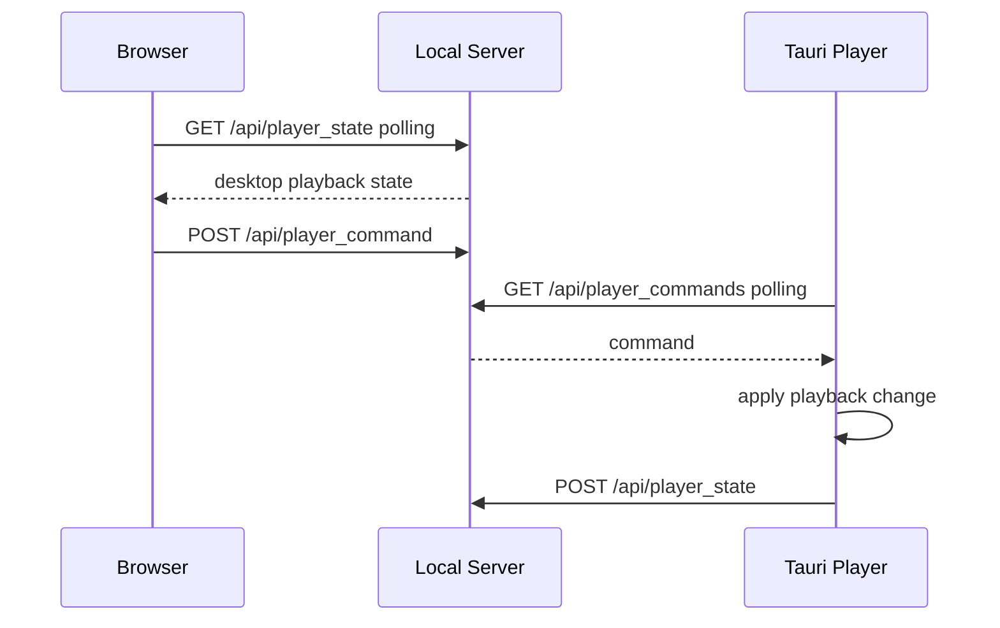
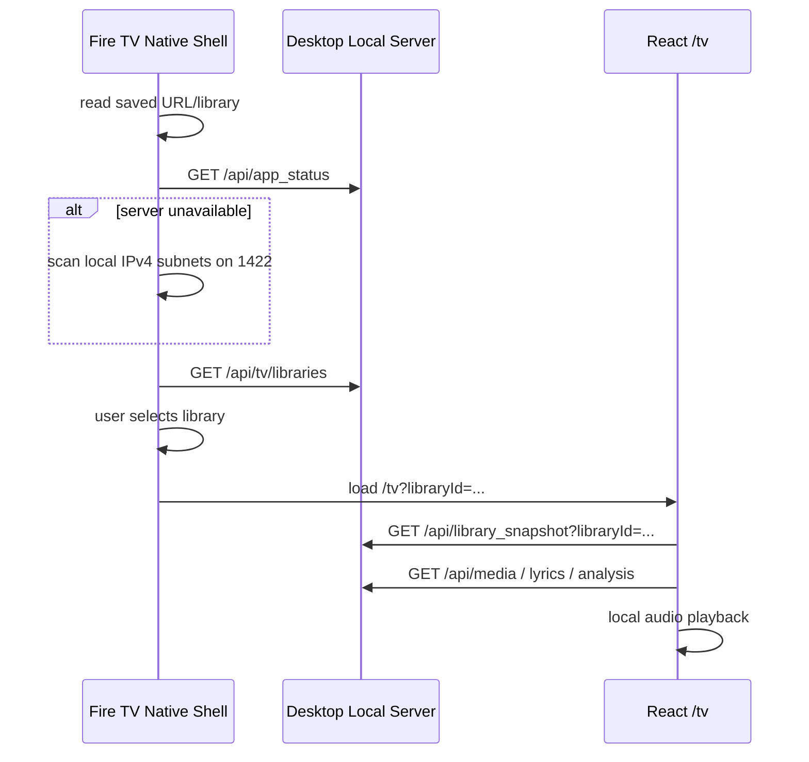

# Musical 基本設計書

この文書は、現在の仕様とコードから見た Musical の基本設計をまとめたものです。
実装変更時は、該当するコード、仕様、機能一覧、基本設計の差分が一致するように更新します。

## 1. システム概要

Musical はデスクトップ音楽プレイヤーを中心に、ブラウザリモート操作と Fire TV 表示を持つローカルファーストなアプリケーションです。

中心責務:

- Desktop app: ライブラリ管理、実音声再生、編集、ローカルサーバー公開。
- Browser app: mock 検証、または desktop backend への remote control。
- Fire TV app: テレビ向け UI と WebView audio によるローカル再生。
- Rust backend: スキャン、DB/ファイル操作、タグ/アートワーク更新、音声解析、local API。

## 2. ランタイム構成

| ランタイム | 実装入口 | 役割 |
| --- | --- | --- |
| React main UI | `src/App.tsx`, `src/app/AppShell.tsx` | デスクトップ/ブラウザ共通 UI |
| React feature hooks | `src/features/**` | library, playback, remote-player, tag-editing, tv-display の責務分割 |
| Tauri backend | `src-tauri/src/lib.rs` | Tauri command と plugin setup |
| Library backend | `src-tauri/src/library.rs`, `src-tauri/src/library/**` | scan, snapshot, playlist, tag, artwork, storage |
| Audio analysis backend | `src-tauri/src/audio_analysis.rs` | FFT bucket 生成と cache |
| Local server | `src-tauri/src/local_server.rs` | `/api/*`, `/tv`, WebSocket, media streaming |
| Fire TV shell | `apps/firetv/app/src/main/java/app/musical/firetv/**` | Android native shell, discovery, Settings, key bridge |
| TV route | `src/features/tv-display/presentation/TvDisplayApp.tsx` | Fire TV/TV browser UI |

## 3. レイヤ設計

### 3.1 React Main UI

`AppShell` は controller から受け取った状態と handler を UI component へ配線します。

主な component:

- `LibrarySidebar`: ライブラリ、設定、テーマ、リモートアクセス導線。
- `AlbumBrowser`: アルバム/曲/プレイリストの一覧、検索、ソート、再生入口。
- `SelectedAlbumPanel`: 選択アルバムの曲、タグ編集導線、詳細表示導線。
- `SelectedPlaylistPanel`: プレイリスト曲の表示、追加、削除、並べ替え。
- `PlayerBar`: 再生状態、キュー、シーク、音量、Player mode 導線。
- `PlayerVisualizerOverlay`: Player mode、ビジュアライザ、歌詞、キュー。
- `TrackDetailDialog`: 曲情報、歌詞、アートワーク候補検索、アートワーク、タグ編集。
- `ArtworkCandidateDialog`: MusicBrainz / Cover Art Archive 由来の候補検索、検索中の進捗表示、候補比較、preview、保存導線。

`src/features/**` は UI から切り出した領域別ロジックです。

- `library`: library selection と Tauri repository。
- `playback`: queue resolution、preferences、HTML audio、Media Session。
- `remote-player`: remote command、remote playback clock、analysis sync。
- `tag-editing`: album/track tag、artwork、user state 更新。
- `tv-display`: TV display message と `/tv` UI。
- `ui-interactions`: mobile/touch gesture。

### 3.2 Tauri/Rust Backend

`src-tauri/src/lib.rs` は Tauri command を定義し、Rust の各 module へ委譲します。

主な command:

- `library_snapshot`
- `scan_music_folder`
- `track_lyrics`
- `create_playlist`
- `add_track_to_playlist`
- `add_tracks_to_playlist`
- `rename_playlist`
- `delete_playlist`
- `remove_playlist_track`
- `reorder_playlist_track`
- `create_playlist_from_album`
- `update_album_tags`
- `update_track_tags`
- `search_artwork_candidates`
- `preview_artwork_candidate`
- `update_album_artwork`
- `update_track_artwork`
- `update_playlist_artwork`
- `update_track_user_state`

Backend の永続化方針:

- ライブラリ DB と解析 cache はライブラリ配下の `.musical` に置く。
- ライブラリと cache を音源ファイルと一緒に持ち運べるようにする。
- app process 内だけで十分な remote state は in-memory に保持する。

### 3.3 Local HTTP/WebSocket Server

Tauri setup 時に local server を開始し、desktop/browser/Fire TV の接続点になります。

主な API:

- `GET /api/app_status`
- `GET /api/library_snapshot`
- `GET /api/tv/libraries`
- `GET /api/track_lyrics`
- `GET /api/track_analysis`
- `GET /api/track_analysis_bytes`
- `GET /api/media`
- `GET /api/player_state`
- `POST /api/player_state`
- `POST /api/player_command`
- `GET /api/player_commands`
- `POST /api/tv/player_event`
- `GET /tv`
- `GET /tv/sessions/{sessionId}` WebSocket

アクセス制御:

- local request は許可する。
- LAN access が明示的に有効になるまで非ローカル request は拒否する。
- media は server が公開した file/API 経由でのみ取得できる。
- アートワーク候補検索と候補画像 download は Tauri command 専用で、local server API には公開しない。

### 3.4 Fire TV Android Shell

Fire TV app は Android/Kotlin native shell と WebView の組み合わせです。

Native shell の責務:

- explicit intent/deep-link display URL を解決する。
- 保存済み server/library/locale を SharedPreferences で保持する。
- local IPv4 subnet の port `1422` を probe し desktop server を検出する。
- `/api/tv/libraries` を読み、Settings に server/library candidates を表示する。
- native tabs: Settings, Albums, Tracks, Player を表示する。
- DPAD、Enter、media keys、number keys、Back を WebView または native shell 操作に変換する。
- WebView lifecycle、splash、status、exit confirmation、memory diagnostics を管理する。
- WebView automatic darkening を無効化する。

WebView `/tv` の責務:

- library snapshot、lyrics、media、analysis を local server から取得する。
- Albums/Tracks/Player の TV surface を描画する。
- WebView `<audio>` で Fire TV local playback を行う。
- TV visualizer を 30 fps 上限で描画し、古い frames は decay/clear する。
- WebSocket session がある場合は display messages を適用する。

## 4. データモデル概要

### 4.1 Library

- Album: id, title, album artist, year, genre, artwork, tracks。
- Track: id, title, artist, duration, track/disc number, file path, lyrics presence, favorite, rating。
- Playlist: id, name, artwork, ordered track paths, resolved tracks, missing tracks。

### 4.2 Playback

- `currentTrack`
- `playbackAlbumId` / playback album context
- `playbackPlaylistId` / playback playlist context
- `playbackQueueTrackIds`
- `isPlaying`
- `isShuffle`
- `repeatMode`: `off`, `all`, `one`
- `currentTime`
- `volume`

### 4.3 Audio Analysis

- Analysis packet は track id、frame interval、frames、complete flag を持つ。
- Frame は time, frequency bands, peak, rms を持つ。
- Frontend は再生時刻の周辺 frame を補間して描画する。
- Fire TV は短い analysis window を繰り返し取得する。

### 4.4 TV Display

- `TvDisplayEnvelope` が session id、sentAt、message を包む。
- message は session snapshot、player state、lyrics state、queue state、analysis packet、command result、candidate prompt、session close を扱う。
- direct `/tv?libraryId=...` flow では HTTP polling も併用する。

## 5. 主要シーケンス

### 5.1 デスクトップ起動

### 5.2 ライブラリスキャン

### 5.3 再生と曲終了

### 5.4 ビジュアライザ解析

### 5.5 Browser Backend Remote Control

### 5.6 Fire TV Direct Launch

## 6. UI 設計方針

- デスクトップ UI は広いライブラリ閲覧と下部 player を中心に構成する。
- 狭い画面ではパネル折りたたみ、長押し、縦スワイプなど mobile-style interaction を使う。
- Player mode は実再生状態を保ったまま full-screen overlay として開く。
- Fire TV UI は 10-foot UI として、視認性、remote focus、低負荷描画を優先する。
- Fire TV の色は modern CSS color functions と fallback color の両方で成立させる。
- UI copy は通常実装では English/Japanese locale のみ更新する。

## 7. エラーとフォールバック

- 解析失敗時も再生、キュー、Player mode を壊さない。
- Remote/offline analysis がなければ Web Audio analyser、または idle 表示へ落とす。
- Browser backend では Tauri native 機能を desktop-only として扱う。
- Fire TV server discovery に失敗した場合は fallback URL と Settings を表示する。
- 保存済み Fire TV library が見つからない場合は自動で先頭 library を選ばず、明示選択を待つ。
- Android WebView の forced dark / unsupported CSS color function により TV player が読めなくならないよう fallback を持つ。

## 8. テストと確認観点

変更内容に応じて次を選択して実行する。

- `npm run build`
- `cargo check`
- `cargo test`
- `VITE_MOCK_DATA=true npx playwright test tests/e2e/library.spec.ts -g "player mode"`
- Fire TV unit tests
- Fire TV debug APK / emulator / device 確認
- real Tauri/local backend での動作確認

重点確認:

- ライブラリスキャン、再読み込み、検索、ソート。
- 再生ボタンと曲終了シーケンス。
- シーク/曲変更時の analysis frame clear。
- Player mode と Chibi visualizer。
- Browser backend remote command の即時 UI 反映。
- Fire TV discovery、library selection、remote navigation、local playback、analysis window。

## 9. ドキュメント更新ルール

機能変更、仕様変更、UI/UX 変更、API/データ構造変更、ランタイム責務変更を行う場合は、コード修正と同じ変更セットで次を確認する。

- 機能棚卸しが変わる場合は `Specs/feature-list.md` を更新する。
- 基本設計や責務分担が変わる場合は `Specs/basic-design.md` を更新する。
- 詳細仕様が変わる場合は `Specs/current-platform-capabilities.md` と `Specs/current-platform-capabilities_JP.md`、または該当する `docs/*.md` を更新する。
- Fire TV protocol / architecture / UI design が変わる場合は `docs/firetv-*.md` を更新する。
- 再生終了、キュー、ボタン状態が変わる場合は `Specs/playback-sequences.md` を更新する。
- ビジュアライザの解析・描画挙動が変わる場合は `docs/visualizer-design.ja.md` を更新する。
