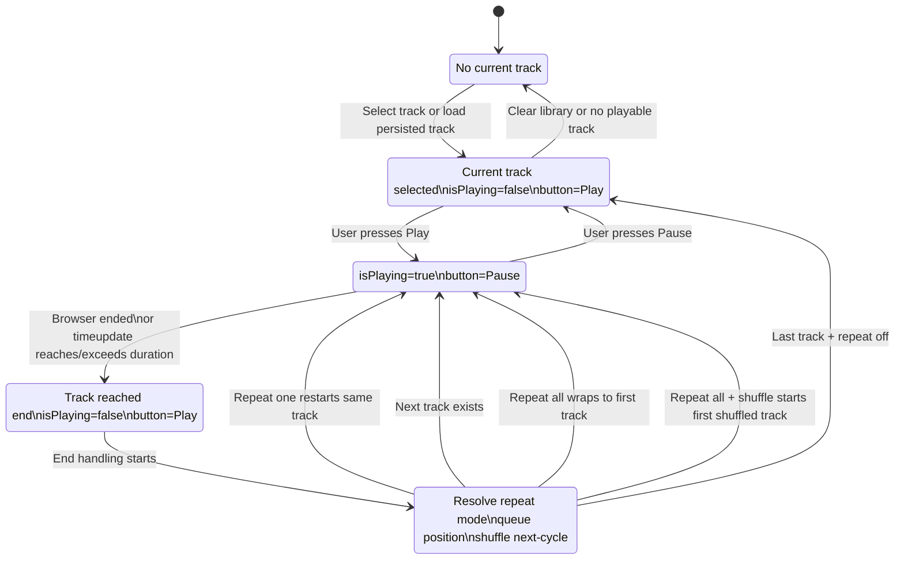
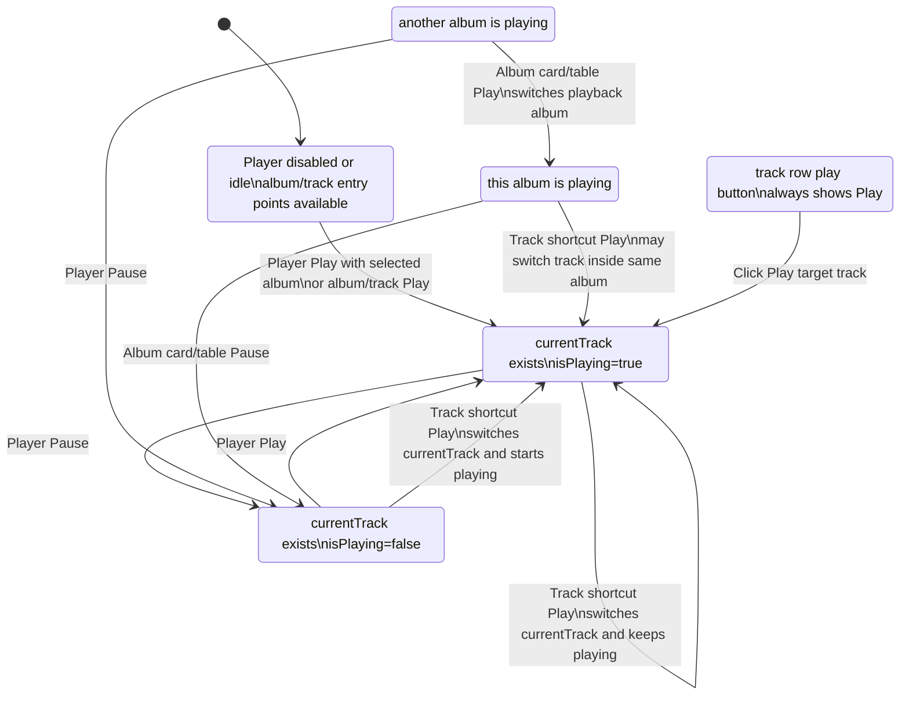
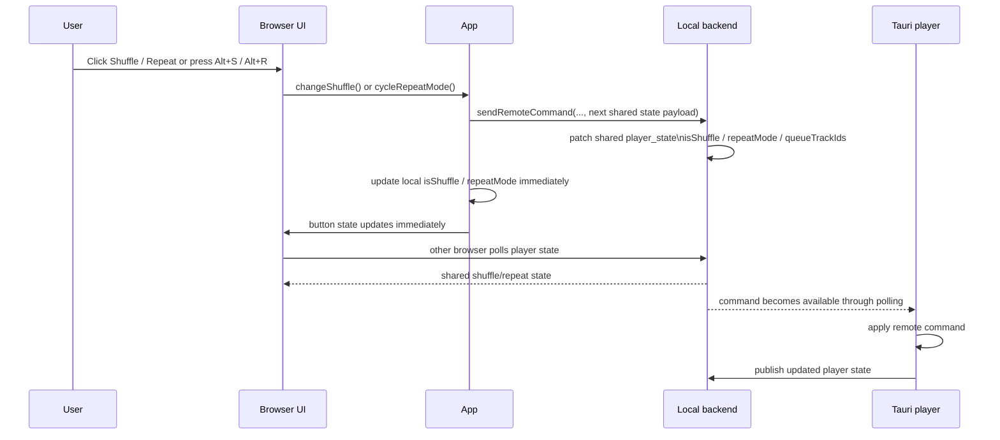
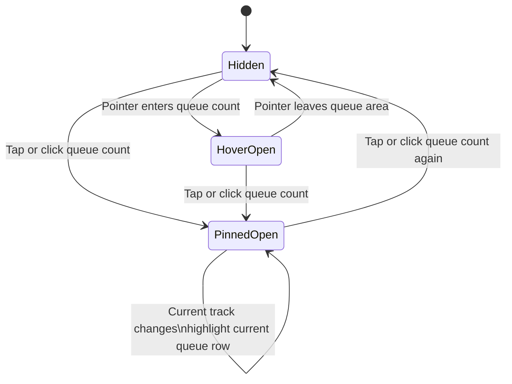
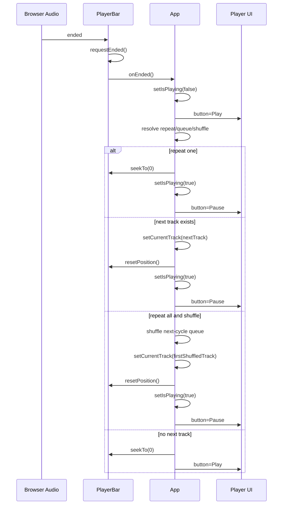
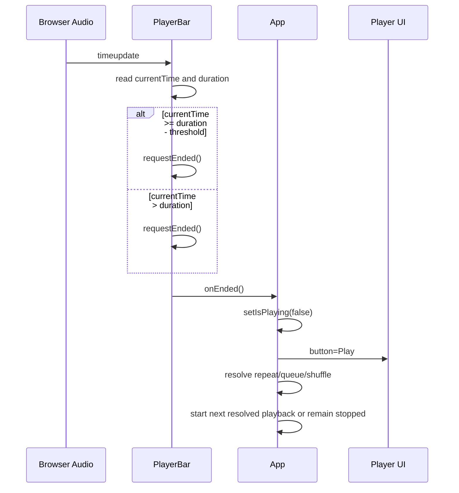

# Playback Sequence Patterns

このメモは、再生中の曲が終端へ到達したときに次曲へ進まない再発を防ぐためのシーケンス洗い出しです。

## Core Objects

- `App.tsx`
  - 再生対象: `currentTrack`
  - 再生状態: `isPlaying`
  - 再生元アルバム: `playbackAlbumId`
  - 再生キュー: `playbackQueueTrackIds`
  - 終了時処理: `handleTrackEnded`
  - 次曲処理: `playNextTrack`
- `PlayerBar.tsx`
  - 表示位置: `currentTime`
  - 曲長: `duration`
  - 重複終了防止: `hasRequestedEndedRef`
  - 終了通知: `requestEnded`
  - 終了検知: `ended` event, `timeupdate`, polling timer, mock timer
  - キュー表示: `queueTracks`
  - キューPopover状態: hover表示、tap/click固定表示

## Expected End-of-Track Flow

1. `audio.currentTime` が `audio.duration` へ到達、または超過する。
2. `PlayerBar` が終了を検知する。
3. `PlayerBar` が `requestEnded()` を1回だけ呼ぶ。
4. `App.handleTrackEnded()` が呼ばれる。
5. 現在の曲は再生状態から停止状態へ移る。
6. プレイヤーUIの主ボタンは一時停止ボタンから再生ボタンへ変化する。
7. `repeatMode === "one"` なら、同一曲の先頭へ戻して再生状態へ戻る。
8. `repeatMode !== "one"` かつ次曲が存在するなら、次曲の先頭へ移動して再生状態へ戻る。
9. 最後の曲で `repeatMode === "all"` なら、キューの先頭へ戻って再生状態へ戻る。
10. 最後の曲で `repeatMode === "all"` かつ `isShuffle === true` なら、先頭へ戻る前に次周のキューをシャッフルする。
11. 最後の曲で `repeatMode === "off"` なら、停止状態のまま位置を0へ戻す。

## End-of-Track State Transition

終端到達時の状態遷移は、次曲がある場合でも一度停止を経由する。

| Step | Track | Playback state | Primary button | Queue action |
| --- | --- | --- | --- | --- |
| 1 | Current track | Playing | Pause | None |
| 2 | Current track reaches end | Stopped | Play | Mark current track complete |
| 3 | Resolve next action | Stopped | Play | Check repeat mode, queue position, shuffle |
| 4a | Same track when repeat one | Playing | Pause | Seek same track to 0 |
| 4b | Next track exists | Playing | Pause | Move to next queued track |
| 4c | Last track with repeat all | Playing | Pause | Move to first queued track |
| 4d | Last track with repeat all and shuffle | Playing | Pause | Shuffle next-cycle queue, then move to first shuffled track |
| 4e | Last track with repeat off | Stopped | Play | Seek to 0 and keep current/end state resolved |

## Event Emission by Layer

曲末尾到達時は、ブラウザの `HTMLAudioElement` が発火するイベントと、アプリが発火・更新する状態を分けて扱う。

### Browser / Audio Element

| Browser sequence | Event or state | Meaning | App expectation |
| --- | --- | --- | --- |
| 1 | `timeupdate` | 再生位置が更新される | `currentTime` 表示を更新する |
| 2a | `currentTime >= duration - threshold` | 終端近傍に到達する | `ended` 未発火でも終端として扱える |
| 2b | `currentTime > duration` | 再生位置が曲長を超過する | `ended` 未発火でも終端として扱える |
| 2c | `audio.ended === true` | ブラウザが終了状態を持つ | 終端として扱う |
| 3 | `ended` | ブラウザが曲の自然終了を通知する | `requestEnded()` を1回だけ呼ぶ |
| 4 | `pause` | ブラウザが再生停止を通知する場合がある | アプリ側の停止状態と矛盾させない |
| 5 | `loadedmetadata` | 次曲のメタデータが読み込まれる | 次曲の `duration` を反映する |
| 6 | `play` / `playing` | 次曲の再生が開始される | UIを再生中へ戻す |

ブラウザ実装や音源状態によって、`timeupdate` が先に終端を示す場合と `ended` が先に来る場合がある。アプリはどちらの順序でも同じ終了シーケンスへ入る。

### App

| App sequence | Event or state update | Meaning |
| --- | --- | --- |
| 1 | `PlayerBar.requestEndedIfAudioIsComplete()` | `timeupdate`, polling, `audio.ended` のいずれかから終端を検知する |
| 2 | `PlayerBar.requestEnded()` | 重複終了通知を抑止しつつ `onEnded` を呼ぶ |
| 3 | `App.handleTrackEnded()` | 曲末尾の業務ルールを開始する |
| 4 | `setIsPlaying(false)` | 現在曲を停止状態へ移す |
| 5 | Player primary button becomes Play | UI上も停止状態を表示する |
| 6 | Resolve repeat/queue/shuffle | 1曲リピート、次曲、全曲リピート、シャッフル次周を判断する |
| 7a | `seekTo(0)` and `setIsPlaying(true)` | 1曲リピートで同一曲を再開する |
| 7b | `setCurrentTrack(nextTrack)`, `resetPosition()`, `setIsPlaying(true)` | 次曲を開始する |
| 7c | Shuffle next-cycle queue, `setCurrentTrack(firstShuffledTrack)`, `setIsPlaying(true)` | シャッフル有効の全曲リピートで次周を開始する |
| 7d | `seekTo(0)` and keep `setIsPlaying(false)` | 次曲なし、全曲リピートなしで停止する |

## Play Button State Diagram

## Playback Button Inventory

UI上で再生を開始、または再生/一時停止を切り替える箇所は次の通り。

| Location | Component | Selector / class | Label source | Icon states | Action | State source |
| --- | --- | --- | --- | --- | --- | --- |
| Player transport primary button | `PlayerBar.tsx` | `.play-button.icon-button` | `player.play`, `player.pause`, `player.idle` | Play / Pause | Toggle current playback | `currentTrack`, `isPlaying` |
| Album card hover play button | `AlbumCard.tsx` | `.album-hover-play` | `album.playSelected`, `player.pause` | Play / Pause | Play this album without selecting it, or pause if this album is playing | album `isPlaying` from parent |
| Album list row play button | `AlbumBrowser.tsx` album table | `.album-table-play-button` | `album.playSelected`, `player.pause` | Play / Pause | Play this album, or pause if this album is playing | `isPlaying && album.id === playbackAlbumId` |
| Track list row play button in selected album panel | `App.tsx` selected album track list | `.track-play-button` | `player.play` + track title | Play only | Play selected track | Always starts target track |
| Global track table play button | `AlbumBrowser.tsx` track table | `.album-table-play-button` | `player.play` | Play only | Play target track from its album | Always starts target track |

非UIの再生入口として、Media Session とキーボードメディアキーも `play`, `pause`, `toggle-playback` を発火する。ただし画面上の再生ボタンではないため、このInventoryでは補助入口として扱う。

## Playback Button State Rules

| Button type | Disabled state | Shows Play | Shows Pause | Click while Play is shown | Click while Pause is shown |
| --- | --- | --- | --- | --- | --- |
| Player transport primary | No `currentTrack` | `currentTrack && !isPlaying` | `currentTrack && isPlaying` | `togglePlayback()` starts current track, or selected album if no current track | `togglePlayback()` pauses |
| Album card hover | None expected for playable album card | The album is not the active playing album | The album is the active playing album and app is playing | `playAlbum(album, { selectAlbum: false })` | `pausePlayback()` |
| Album table row | None expected for playable album row | The album is not the active playing album | The album is the active playing album and app is playing | `playAlbum(album)` | `pausePlayback()` |
| Selected album track row | None expected for playable track | Always | Never | `playTrack(track, selectedAlbum.id)` | Not applicable |
| Global track table row | None expected for playable track | Always | Never | `playTrack(track, album.id)` | Not applicable |

## All Playback Button State Diagram

## Button State Expectations During End-of-Track

曲末尾到達時、状態が一度 `EndingStopped` へ移るため、すべての再生ボタン表示は同じ停止状態を反映する。

| End state step | Player transport | Active album card | Active album table row | Track row buttons |
| --- | --- | --- | --- | --- |
| Current track playing | Pause | Pause for playback album | Pause for playback album | Play |
| End detected, before next resolution | Play | Play album | Play album | Play |
| Next track starts | Pause | Pause for playback album | Pause for playback album | Play |
| Last track stops with repeat off | Play | Play album | Play album | Play |

## Browser Remote Control Expectations

ブラウザ版は Tauri 本体と状態同期するために remote command を送るが、操作したブラウザ自身のUIも即時更新する必要がある。

| User action source | Command | Local expectation | Remote expectation |
| --- | --- | --- | --- |
| Browser shuffle button | `toggle-shuffle` | `isShuffle` と `playbackQueueTrackIds` を即時更新する | Backend の共有 state も部分更新し、Tauri 側へ `isShuffle` と `queueTrackIds` を送る |
| Browser `Alt+S` | `toggle-shuffle` | シャッフルボタンが即時 pressed になり、次曲順も更新される | 他ブラウザ端末も polling で同じ `isShuffle` / queue を受け取る |
| Browser repeat button | `cycle-repeat` with `repeatMode` | `repeatMode` が `off -> all -> one -> off` へ即時更新される | Backend の共有 state も指定 `repeatMode` へ部分更新する |
| Browser `Alt+R` | `cycle-repeat` with `repeatMode` | リピートボタン表示が即時 `Repeat all` / `Repeat one` へ変わる | 他ブラウザ端末も polling で同じ `repeatMode` を受け取る |

remote command 送信に成功しても失敗しても、操作元ブラウザのローカル状態更新を早期 return でスキップしてはいけない。シャッフルとリピートは端末間で共有するプレイヤー状態なので、local backend は command 受信時に保持中の `player_state` の該当フィールドを部分更新する。remote state polling は後続の同期として扱い、ユーザー操作の即時フィードバックを阻害しない。

## Queue Popover Expectations

`PlayerBar` の `Queue / N tracks` または `キュー / N 曲` は件数表示であると同時にキュー一覧の表示トリガーとして扱う。

| Trigger | Expected state | Close behavior |
| --- | --- | --- |
| Hover over queue count | Queue popover becomes visible | Pointer leaves queue trigger/popover area |
| Tap/click queue count when closed | Queue popover becomes pinned open | Tap/click queue count again |
| Tap/click queue count when pinned open | Queue popover closes | N/A |
| Current track changes | Current row in queue popover updates | Popover visibility state is independent |

## End Event Sequence Diagrams

### Browser `ended` First

### `timeupdate` Reaches or Exceeds Duration First

## Sequence Matrix

| Pattern | Trigger | Repeat | Queue position | Expected result | Regression coverage |
| --- | --- | --- | --- | --- | --- |
| A1 | Native `ended` event | off | middle | Next track starts | `advances to the next track on the audio ended event` |
| A2 | Native `ended` event | off | last | Playback stops and seek returns to 0 | `stops and seeks to zero when the last track ends with repeat off` |
| A3 | Native `ended` event | all | last | First queue track starts | `wraps to the first track when the last track ends with repeat all` |
| A4 | Native `ended` event | one | any | Same track restarts from 0 | `restarts the same track when it ends with repeat one` |
| B1 | `timeupdate` at `currentTime >= duration - 0.2` | off | middle | Next track starts | Existing end seek test partially covers |
| B2 | `timeupdate` at `currentTime > duration` | off | middle | Next track starts | `advances to the next track when audio time exceeds duration` |
| B3 | Repeated `timeupdate` after completion | off | middle | Only one next transition occurs | `keeps advancing after consecutive tracks reach the end` partially covers |
| C1 | Real-backend polling sees completion | off | middle | Next track starts | Needed with real backend/manual validation |
| C2 | Mock timer reaches duration | off | middle | Next track starts | Existing end seek test partially covers |
| D1 | User clicks Next | any except remote takeover | middle | Next track starts | Existing controls coverage |
| D2 | User clicks Previous after more than 3s | any | any | Same track seeks to 0 | Needed |
| D3 | User clicks Previous within first 3s | any | any | Previous queue track starts | Needed |
| E1 | Shuffle toggled while playing | off to on | any | Album playback reshuffles the album queue; playlist playback reshuffles only the playlist queue, with the current track first | Existing shuffle queue tests |
| E2 | Shuffle toggled while playing | on to off | any | Queue returns to its source album order or stored playlist order | Existing shuffle queue tests |
| E3 | Last track completes with shuffle and repeat all | on | last | Next-cycle queue is reshuffled, then first shuffled track starts | `reshuffles the next cycle when the last track ends with repeat all and shuffle` |
| F1 | Remote `next` command | any | middle | Next track starts through command path | Needed |
| F2 | Remote `seek` near end then completion | off | middle | Next track starts without local/remote loop | Needed |
| G1 | Browser shuffle button or `Alt+S` | any | any | Browser UI and queue update immediately, remote command is still sent | `toggles shuffle from the keyboard shortcut` |
| G2 | Browser repeat button or `Alt+R` | off/all/one | any | Browser UI updates immediately through repeat cycle, remote command is still sent | `cycles repeat from the keyboard shortcut` |
| H1 | Hover over queue count | any | any | Queue popover appears with current queue rows | `shows and toggles the player queue popover` |
| H2 | Tap/click queue count twice | any | any | Queue popover opens, then closes on second tap/click | `shows and toggles the player queue popover` |

## Current Risk Notes

- `PlayerBar.requestEndedIfAudioIsComplete()` treats both `audio.ended` and `audio.currentTime >= audio.duration - 0.2` as completion. This should also cover `currentTime > duration`.
- `hasRequestedEndedRef` prevents duplicate ended handling. It is reset by `resetPosition()`, which runs when `currentTrack` changes and is also called by next/previous/album playback paths.
- The risky interval is the transition between `requestEnded()` and the next `currentTrack` render. If another completion event fires before reset, it must be ignored; after the next track is active, completion must be allowed again.
- The most suspicious failure mode is a stale `hasRequestedEndedRef` after an end transition, because it would suppress the next track's later completion. The consecutive-end UI test protects this.
- Another suspicious failure mode is relying only on the native `ended` event. The new overflow-time UI test protects the explicit `currentTime > duration` path.
- Browser remote-control paths must not early-return before local optimistic updates. This was observed for shuffle and repeat controls, where remote command delivery worked but the operating browser did not update immediately.
- `applyRemotePlayerState()` must apply both `repeatMode` and `isShuffle`; otherwise one browser can publish the shared state but another browser will not reflect the shuffle button state.
- The desired product sequence explicitly includes a temporary stopped state at track end. The implementation sets `isPlaying` false first and resolves the next action on a later tick, but a dedicated stable-state assertion can make this easier to observe.
- Queue popover rows should not use generic `listitem` roles if that collides with selected-album track-list tests or screen-reader navigation for the main track list.

## Recommended Next Tests

- End-of-track transition exposes the stopped state and Play button before moving to repeat/next-track playback.
- Real-backend smoke test with a very short local audio file, because browser mocks cannot fully verify native audio event timing.
- Browser real-backend smoke test for shuffle/repeat local optimistic update without relying on mock mode.
- Remote command tests for `next`, `previous`, `seek`, `toggle-shuffle`, and `cycle-repeat` through the local backend queue.
