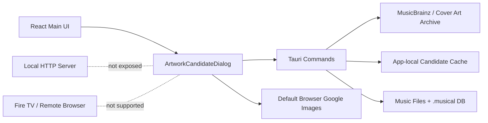

# アルバムアートワーク検索・保存設計

## 目的

選択中のアルバムに対して、アプリ内でアートワーク候補を閲覧し、ユーザーが選んだ画像を対象アルバムのアートワークとして保存できるようにする。

この機能はローカル Tauri desktop runtime 専用とする。ブラウザリモート、Fire TV、mock runtime、local server 公開 API には候補検索・画像取得・保存機能を出さない。

## 前提

- Musical は既に曲アートワークとプレイリストアートワークの保存機能を持つ。
- 現在の曲アートワーク保存は `update_track_artwork` command が担当する。
- 既存保存処理は画像ファイルを読み、`lofty` で音声ファイルの CoverFront を置換し、アートワーク cache path を album row に反映する。
- Tauri opener plugin は既に導入済みで、外部 URL を既定ブラウザで開ける。
- `src-tauri/Cargo.toml` には direct HTTP client がまだない。

## Scope

### In

- Tauri main window 専用のアートワーク候補閲覧画面。
- アルバム名、アルバムアーティスト、補助語からの検索 query 生成。
- MusicBrainz / Cover Art Archive を使ったアルバムアート候補取得。
- 日本語タイトルから英字断片、Wikidata 英語ラベルを内部検索 query として使う。
- 任意の Google Images 外部ブラウザ起動。
- ローカル画像ファイル選択。
- 手動画像 URL 貼り付け preview。
- 候補画像の preview と保存前確認。
- 保存後の library snapshot refresh。
- 保存先としてのアルバムアートワーク更新。

### Out

- Google Images HTML scraping。
- Google API key の同梱。
- 有料 SERP API の必須化。
- Fire TV、browser remote、local server `/api/*` からの候補検索。
- mock runtime での実画像取得・実ファイル保存。
- ユーザー確認なしの自動保存。

## ランタイム境界



設計方針:

- 候補検索と画像 download は Tauri command に閉じる。
- local server には artwork candidate search / download endpoint を追加しない。
- Fire TV / remote clients / MCP schema には候補検索を公開しない。
- `hasRealBackend && isTauriRuntime` のときだけ UI 入口を表示する。
- 検索結果一覧では MusicBrainz release の文字候補に加え、候補ごとの Cover Art Archive 小画像を app-local cache に保存して thumbnail として表示する。画像取得に失敗した候補だけ placeholder を表示する。
- release search で取りこぼしやすい盤に備えて MusicBrainz release-group search も併用し、release-group に紐づく代表 release を候補へ混ぜる。例: `Violinism Acoustic Best 葉加瀬太郎` から release-group `VIOLINISM III` を拾い、release ID を候補化する。
- 先頭の有効な曲名と曲 artist がある場合は MusicBrainz recording search も併用し、その recording が収録されている release を候補へ混ぜる。album title が崩れている場合でも、`一番上の曲名 + artist -> 収録 album` の逆引きで候補を補完する。
- album artist が有効な場合は `artist:"..." AND release:"..."` 形式の MusicBrainz query を先に実行し、候補一覧の並びでも artist-credit が一致する release を優先する。
- 検索結果一覧を表示した後、候補 release の詳細をバックグラウンドで上から直列取得し、編集中アルバムとの一致度を候補 card に表示する。
- バックグラウンド取得した MusicBrainz release 詳細は release id ごとに LocalStorage へ保存し、再検索・候補選択時に再利用する。
- Cover Art Archive から取得した候補 thumbnail は検索結果と一緒に返し、preview 済みの画像 path は release id ごとに LocalStorage へ保存する。同じ候補を再選択したときは再 download せずに右パネルの preview と候補 card に復元する。
- frontend state では表示用 URL と保存用 raw path を分けて保持する。候補 thumbnail を右パネルに表示する場合も raw path を保持し、保存時は raw path を Tauri command へ渡す。
- 一致度はアルバム名・アーティスト・曲数だけでなく、曲タイトルを正規化した重み付き文字ベクトルで算出する。曲リストが有効な場合は、曲順一致と順不同の最適対応を組み合わせ、曲リスト一致と曲数一致を強い根拠にする。
- `Untitled` / `Untitle` / `Unknown Track` / `無題` などの仮タイトルだけで構成される曲リストは曲一致の根拠にしない。この場合も曲数一致は補助的に評価するが、アルバム名またはアーティストの手がかりがある場合にだけ加点する。
- ユーザーが release 候補を選択した時点では MusicBrainz release 詳細と track list だけを取得し、編集中アルバムの track list と並べてアルバム名・アーティスト・曲順を確認できるようにする。
- ユーザーが release 内容を確認して `アートワークを確認` を押したときだけ Cover Art Archive の front image URL を解決し、app-local cache に保存した preview を `convertFileSrc` で表示する。
- 候補画面は先に開き、初回候補検索は次 paint 後に開始する。
- アートワーク候補ダイアログを開いた直後から候補一覧が表示されるまで、候補一覧エリアに処理内容と流れるプログレスバーを表示する。ダイアログ準備、検索語準備、MusicBrainz release 検索、release-group/曲手がかり確認、候補画像読み込み、候補一覧読み込み、候補表示までを同じバーに乗せる。
- 候補がまだない場合は空状態の中央に、既存候補が残っている再検索では一覧上部に表示する。候補一覧が表示された後の一致度採点も同じバーの終盤として短く表示する。
- Tauri command 内の各非同期検索 step は `musical-artwork-search-progress` event として frontend へ送る。frontend は同じ payload を `[artwork-search]` console log にも出し、表示処理が動いているかを画面とログの両方で確認できるようにする。
- MusicBrainz search は 503/429 を避けるため直列・短い待機つきで実行する。Cover Art Archive へのアクセスは候補一覧の thumbnail 取得と、候補選択後の preview 取得に限定する。

## ユーザー体験

1. ユーザーが選択中アルバムのアートワーク編集を開く。
2. アプリが album title / album artist から検索 query を生成する。
3. ユーザーは候補画面を開く。
4. 候補画面で `候補`, `URL`, `ローカル` を切り替える。
5. `候補` タブは MusicBrainz release の文字候補を表示する。
6. 日本語タイトルや長いタグ名の場合は、英語名・別表記・英字断片を内部 query として MusicBrainz search に使う。
7. `URL` タブはユーザーが貼り付けた画像 URL を検証して preview する。
8. `ローカル` タブは既存のネイティブ画像 picker を使う。
9. ユーザーが候補を選ぶと、MusicBrainz release 詳細を読み込み、アルバム名・アーティスト・年・国・曲一覧と編集中アルバムの曲一覧を表示する。
10. ユーザーが内容を確認して `アートワークを確認` を押すと、その時点で Cover Art Archive から front image を取得して大きめ preview に表示する。
11. ユーザーが保存すると、対象アルバムのアートワークとして保存する。
12. 保存後、library snapshot を再読み込みし、AlbumCard、SelectedAlbumPanel、PlayerBar、Player mode、TV 表示へ反映する。

## 画面設計

### 入口

- `SelectedAlbumPanel` のアートワーク編集ボタンから開く。
- `TrackDetailDialog` の Artwork tab からも開ける。
- Tauri runtime でない場合は候補閲覧入口を表示しない。

### ArtworkCandidateDialog

表示要素:

- 検索 query input。
- `候補`, `URL`, `ローカル` tabs。
- 候補 grid。
- 選択中 release のアルバム名・アーティスト・年・国・曲一覧と、編集中アルバムの曲一覧。
- 選択中候補 preview。
- source link。
- 保存前の権利確認メッセージ。
- `保存`, `キャンセル`, `Google画像で探す` actions。

候補 card:

- thumbnail。
- release title。
- artist。
- year。
- source badge。
- selected state。

検索 query 正規化:

- Unicode ローマ数字を ASCII ローマ数字へ変換する。
- Google 画像検索向けの `album cover` などは大小文字に依存せず検索語から除外し、末尾に album artist が混ざった場合は album title 候補から落とす。
- `サントラ`、`CD-BOX`、`DISC-01` など検索精度を下げる分類・媒体情報を落とした検索用タイトルを先に作る。
- `Chrono Cross Disc 3 Various Artists` のように `Disc N` が release 特定に効く英字タイトルでは、末尾の `Various Artists` を artist 表記として除外し、`Chrono Cross Original Soundtrack Disc 3` / `Chrono Cross Disc 3` などの検索候補を作る。
- `Final Fantasy IV Piano Collection` のような series title + collection type の英字タイトルでは、MusicBrainz 上の表記に合わせて `Piano Collections: Final Fantasy IV` 形式の候補も作る。
- release 直検索で候補が弱い場合に備え、同じ検索語を release-group search にも渡し、first release date と artist が近い album group から release 候補を補完する。
- 先頭の有効曲名がある場合は `artist:"..." AND recording:"..."` を MusicBrainz recording search に渡し、返却された releases を候補へ混ぜる。`Untitled 01` などの仮タイトルは recording search に使わない。
- album artist が `Various Artists` / `オムニバス` のような総称でない場合、artist 制約つき query を title-only query より先に実行する。
- artist 制約つき検索で得た候補の artist-credit が album artist と一致しない場合は、英語名/日本語名など MusicBrainz 側の表記差分を考慮して title-only query の候補も補完する。
- 候補の並び替えでは artist-credit 一致を優先するが、MusicBrainz score の差が大きい場合は title match の強い候補を上限外へ押し出さない。
- 日本語文字列に含まれる英字/数字 fragment を抽出する。
- `機動戦士ガンダムSEED DESTINY OST Ⅰ (音楽)佐橋俊彦` から `SEED DESTINY OST I` を候補化する。
- ノイズ除去後の日本語タイトルを Wikidata の日本語検索へ渡し、英語 label を取得する。
- `サントラ カウボーイビバップ CD-BOX DISC-01` から `カウボーイビバップ` を作り、Wikidata 逆引きで `Cowboy Bebop` を候補化する。
- 正規化で得た query 候補は MusicBrainz search に使うが、画面上には表示しない。
- MusicBrainz search result の release をアルバム候補として表示する。

状態:

- idle。
- searching。
- search error。
- candidates loaded。
- candidate preview loading。
- candidate selected。
- saving。
- saved。
- partial saved。

## Frontend 設計

### 追加候補ファイル

```txt
src/lib/artworkSearch.ts
src/components/ArtworkCandidateDialog.tsx
src/features/tag-editing/application/searchArtworkCandidates.ts
src/features/tag-editing/application/previewArtworkCandidate.ts
src/features/tag-editing/application/updateAlbumArtwork.ts
```

### 型

```ts
export type ArtworkCandidateSource =
  | "cover-art-archive"
  | "itunes-search"
  | "manual-url"
  | "local-file";

export type ArtworkCandidate = {
  id: string;
  source: ArtworkCandidateSource;
  title: string;
  artist?: string | null;
  year?: string | null;
  thumbnailPath?: string | null;
  previewPath?: string | null;
  imageUrl?: string | null;
  pageUrl?: string | null;
  width?: number | null;
  height?: number | null;
};

export type ArtworkCandidateSearchRequest = {
  albumTitle: string;
  albumArtist: string;
  limit?: number;
};
```

### Query 生成

```ts
export function buildArtworkSearchQuery(albumTitle: string, albumArtist: string, trackArtist?: string) {
  return [albumTitle, albumArtist || trackArtist, "album cover"]
    .filter(Boolean)
    .join(" ")
    .replace(/\s+/g, " ")
    .trim();
}

export function buildGoogleImagesUrl(query: string) {
  const params = new URLSearchParams({ tbm: "isch", q: query });
  return `https://www.google.com/search?${params.toString()}`;
}
```

### Controller state

`useAppController` に追加する状態:

- `isArtworkCandidateDialogOpen`
- `artworkSearchQuery`
- `artworkCandidates`
- `selectedArtworkCandidateId`
- `artworkCandidatePreviewSrc`
- `isSearchingArtworkCandidates`
- `isPreviewingArtworkCandidate`
- `isSavingAlbumArtwork`
- `artworkCandidateMessage`

主要 action:

- `openArtworkCandidateDialog(album)`
- `closeArtworkCandidateDialog()`
- `changeArtworkSearchQuery(value)`
- `searchArtworkCandidates()`
- `previewArtworkCandidate(candidate)`
- `chooseLocalArtwork()`
- `previewManualArtworkUrl(url)`
- `saveSelectedArtworkToAlbum()`
- `openArtworkGoogleSearch()`

## Backend 設計

### Tauri commands

Phase 1 で最低限必要な command:

```rust
#[tauri::command]
fn search_artwork_candidates(
    app: tauri::AppHandle,
    request: ArtworkCandidateSearchRequest,
) -> Result<ArtworkCandidateSearchResult, String>;

#[tauri::command]
fn preview_artwork_candidate(
    app: tauri::AppHandle,
    request: ArtworkCandidatePreviewRequest,
) -> Result<ArtworkCandidatePreviewResult, String>;

#[tauri::command]
fn update_album_artwork(
    app: tauri::AppHandle,
    request: AlbumArtworkUpdateRequest,
) -> Result<AlbumArtworkUpdateResult, String>;
```

候補検索:

- album title / artist で MusicBrainz release search を行う。
- release MBID から Cover Art Archive front cover metadata を取得する。
- thumbnail を app-local candidate cache へ保存する。
- UI には local thumbnail path と source metadata を返す。

Preview:

- candidate image URL または manual URL を download する。
- timeout、redirect limit、max bytes、content-type、magic byte を検証する。
- app-local candidate cache に preview file を保存する。
- UI には local preview path を返す。

保存:

- Phase 1 では既存の `update_track_artwork` を流用できる。
- 厳密なアルバム保存では `update_album_artwork` を追加する。
- `update_album_artwork` は album id から track paths を取得し、各 track file の CoverFront を置換する。
- 成功が 1 件以上あれば album row の `artwork_path` を更新する。
- 一部失敗は `failedFiles` として返す。

### Rust models

```rust
#[derive(Debug, Deserialize)]
#[serde(rename_all = "camelCase")]
pub struct ArtworkCandidateSearchRequest {
    pub album_title: String,
    pub album_artist: String,
    pub limit: Option<usize>,
}

#[derive(Debug, Serialize)]
#[serde(rename_all = "camelCase")]
pub struct ArtworkCandidateSearchResult {
    pub candidates: Vec<ArtworkCandidate>,
}

#[derive(Debug, Serialize)]
#[serde(rename_all = "camelCase")]
pub struct ArtworkCandidate {
    pub id: String,
    pub source: String,
    pub title: String,
    pub artist: Option<String>,
    pub year: Option<String>,
    pub thumbnail_path: Option<String>,
    pub preview_path: Option<String>,
    pub image_url: Option<String>,
    pub page_url: Option<String>,
    pub width: Option<u32>,
    pub height: Option<u32>,
}

#[derive(Debug, Deserialize)]
#[serde(rename_all = "camelCase")]
pub struct ArtworkCandidatePreviewRequest {
    pub candidate_id: Option<String>,
    pub image_url: String,
}

#[derive(Debug, Serialize)]
#[serde(rename_all = "camelCase")]
pub struct ArtworkCandidatePreviewResult {
    pub preview_path: String,
}

#[derive(Debug, Deserialize)]
#[serde(rename_all = "camelCase")]
pub struct AlbumArtworkUpdateRequest {
    pub album_id: String,
    pub artwork_path: String,
}

#[derive(Debug, Serialize)]
#[serde(rename_all = "camelCase")]
pub struct AlbumArtworkUpdateResult {
    pub album_id: String,
    pub artwork_path: String,
    pub updated_files: usize,
    pub failed_files: Vec<TagWriteFailure>,
}
```

## 候補取得 source

### Cover Art Archive

優先 source。

- MusicBrainz release search で release candidates を取得する。
- release MBID ごとに Cover Art Archive metadata/front thumbnail を取得する。
- `front == true` または `types` に `Front` を含む画像を優先する。
- `approved == true` を優先する。
- thumbnail は `small` または `500` を grid に使う。
- original/front image は preview/save に使う。

### Apple iTunes Search API

任意 source。

- API key なしで album search ができる。
- `artworkUrl100` を高解像度 URL へ変換できる場合がある。
- 利用条件に注意し、保存用 source として扱う前に確認する。
- 初期実装では無効または fallback 候補にする。

### Google Images

補助導線。

- アプリ内候補取得 source にはしない。
- `Google画像で探す` ボタンで既定ブラウザを開く。
- ユーザーが保存したローカル画像を選ぶか、画像 URL を手動貼り付けする。

### Wikidata

タイトル逆引き source。

- 日本語作品名から英語 label を取得するために使う。
- API key は不要。
- 取得した label は画像保存元ではなく、MusicBrainz / Cover Art Archive の検索 query 候補としてだけ使う。
- Wikidata 候補は local server に公開せず、Tauri command 内で扱う。

## Cache 設計

候補画像は app-local data 配下へ保存する。

候補:

```txt
<app_data>/artwork_candidates/
  thumbnails/
  previews/
```

方針:

- library `.musical/artwork` は保存済みアートワーク用に使う。
- candidate cache は一時候補なので app data 側に置く。
- candidate cache は source URL hash + bytes hash で命名する。
- 保存時に library artwork cache へ正式保存する。
- 古い candidate cache は起動時または検索前に掃除する。

## セキュリティと検証

画像 download:

- `https` のみ許可する。
- host allowlist を source adapter ごとに持つ。
- redirect 回数を制限する。
- timeout を設定する。
- max bytes を設定する。初期値は 10 MB。
- content-type は `image/jpeg`, `image/png`, `image/gif`, `image/bmp`, `image/tiff` を許可候補にする。
- content-type を信用せず magic byte で再検証する。
- 保存前に既存 `make_front_cover_picture` を必ず通す。

UI:

- 候補選択だけでは音声ファイルを書き換えない。
- 保存前にユーザーが preview を確認する。
- 権利確認メッセージを表示する。
- external source link を表示する。

Runtime:

- Tauri command は main window からの invoke を前提にする。
- local server には endpoint を追加しない。
- Fire TV / browser remote では candidate UI を出さない。

## Error Handling

- 検索 query が空:
  - album title / artist から再生成する。
  - それでも空なら検索ボタンを無効化する。
- source が候補なし:
  - `候補が見つかりませんでした` を表示し、Google画像/URL/ローカルへ誘導する。
- download 失敗:
  - candidate card に retry を出す。
- unsupported image:
  - 既存 `library.error.unsupportedArtwork` を使う。
- album 全曲保存で一部失敗:
  - 成功数と失敗数を表示する。
  - `failedFiles` は詳細表示できるようにする。
- 全件失敗:
  - album row は更新しない。

## Specs 更新対象

実装時は次を更新する。

- `Specs/feature-list.md`
- `Specs/basic-design.md`
- `Specs/current-platform-capabilities.md`
- `Specs/current-platform-capabilities_JP.md`
- 必要に応じてこの設計書。

UI copy を追加/変更する場合は通常実装では次のみ更新する。

- `src/locales/en.xml`
- `src/locales/ja.xml`

## 実装フェーズ

### Phase 1: ローカル Tauri 専用候補画面の土台

- `ArtworkCandidateDialog` を追加する。
- `Google画像で探す` と local file picker を統合する。
- candidate UI は Tauri runtime のみ表示する。
- 保存は既存 `update_track_artwork` 流用で開始する。

### Phase 2: アルバム全曲保存

- `update_album_artwork` を追加する。
- 選択アルバム内の全 track file に CoverFront を保存する。
- 一部失敗 result を UI で扱う。

### Phase 3: Cover Art Archive 候補取得

- Rust command で MusicBrainz / Cover Art Archive から候補を取得する。
- candidate cache と preview を実装する。
- 候補 grid から保存できるようにする。

### Phase 4: Optional sources

- iTunes Search API を任意 source として検討する。
- 手動 URL preview/save を追加する。
- Google Images は外部ブラウザ補助導線のまま維持する。

## Acceptance Criteria

- Tauri desktop runtime でのみ候補画面入口が表示される。
- Fire TV、browser remote、mock runtime では候補検索 UI が表示されない。
- local server に artwork candidate endpoint が追加されていない。
- 候補画像を grid で閲覧できる。
- 候補選択後、大きめ preview を確認できる。
- 保存操作まで音声ファイルは変更されない。
- 保存後に album artwork が UI 全体へ反映される。
- unsupported image、download failure、partial write が UI で説明される。
- 通常確認は real Tauri/local backend で行う。
