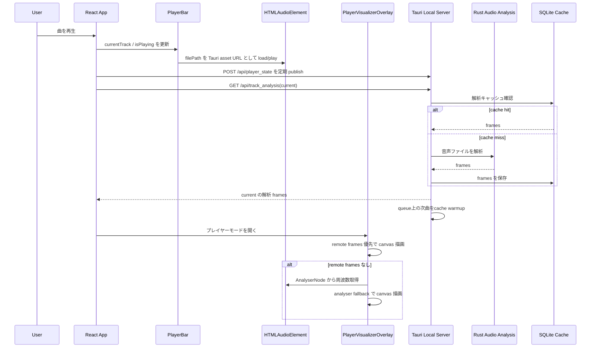
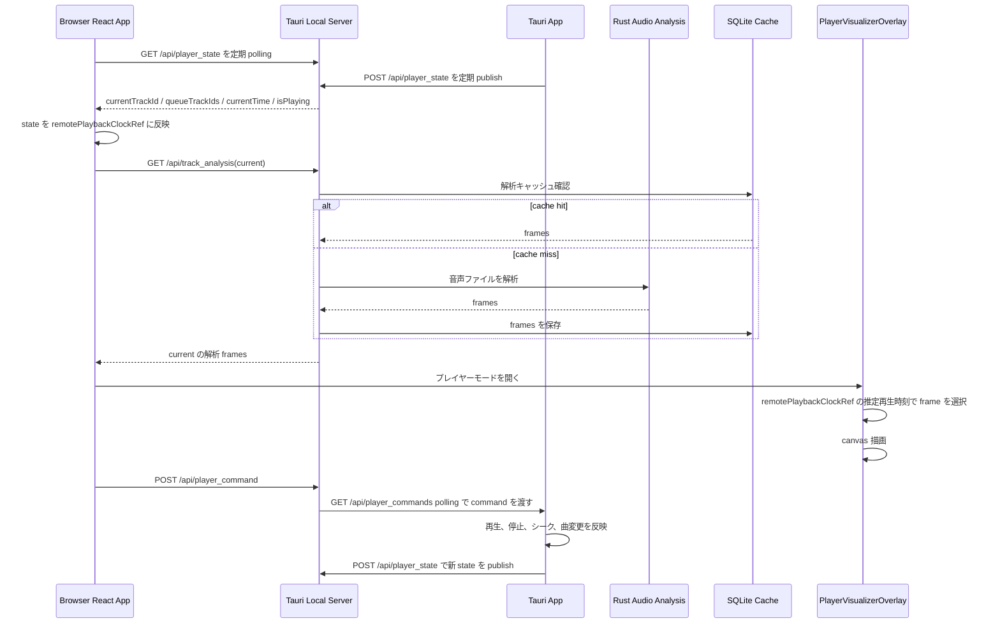

# ビジュアライザ設計書

この文書は、プレイヤービジュアライザの大きな修正時にデグレ確認するための仕様メモです。

対象は以下の 2 系統です。

- アプリ版: Tauri アプリ内で再生し、同じアプリ内のプレイヤーモードでビジュアライザを表示する
- ブラウザ版: Tauri のローカルサーバーにブラウザから接続し、アプリ側の再生状態と解析データを同期してビジュアライザを表示する

## 関連ファイル

- `src/App.tsx`
- `src/components/PlayerBar.tsx`
- `src/components/PlayerVisualizerLoadingOverlay.tsx`
- `src/components/PlayerVisualizerOverlay.tsx`
- `src/components/visualizer-assets/*.ts`
- `src/lib/auroraWebgl.ts`
- `src/lib/audioAnalysis.ts`
- `src/lib/backend.ts`
- `src/lib/helixWebgl.ts`
- `src/lib/warpHoleWebgl.ts`
- `src/lib/starfieldWebgl.ts`
- `src/lib/visualizerAnalysis.ts`
- `tests/e2e/visualizer-webgl.spec.ts`
- `src-tauri/src/local_server.rs`
- `src-tauri/src/audio_analysis.rs`
- `src/config/appConfig.ts`

## 主要コンポーネント

### PlayerBar

再生対象の `<audio>` を保持し、再生、停止、シーク、音量、現在時刻を管理する。

Tauri アプリ版では、`getBackendMediaSrc(filePath)` でローカルファイルを Tauri asset URL に変換して `<audio>` に読み込む。

### PlayerVisualizerOverlay

プレイヤーモードの overlay。基本の `visualizer-canvas` に波、スペクトラム、サークル、山脈、カラーフロー、VU メーターを Canvas 2D で描画する。オーロラは専用の `visualizer-aurora-canvas`、スターフィールドは専用の `visualizer-starfield-canvas`、DNA 螺旋は専用の `visualizer-helix-canvas`、ワープホールは専用の `visualizer-warp-hole-canvas` に Three.js/WebGL2 で描画し、WebGL 初期化に失敗した場合だけ基本 canvas の Canvas 2D 実装へ fallback する。ちびキャラオーケストラは通常ボタンに表示しない隠しモードとする。

Player mode の画面 module は、アプリ起動直後の effect で非同期に事前ロードし、選曲や入口操作を待たず ready 状態へ反映する。現在曲の歌詞も選曲時に非同期取得しておき、Player mode を開く操作ではデータ取得を開始しない。取得済み module の component を直接描画し、`React.lazy` の初回解決による余分な Suspense fallback を挟まない。開閉 state は `PlayerExperience` 内へ隔離し、入口押下でlibrary controllerとライブラリ全体を同期再描画しない。押下時は `PlayerVisualizerLoadingOverlay` を同期描画し、2回の `requestAnimationFrame` 後に実体を mount して、Canvas初期化より先に少なくとも1フレームの操作応答を表示する。Canvas、音声解析、描画 loop などのビジュアライザ実体はこの mount 時に初めて生成する。画面 module の事前ロードが未完了の場合は同じ shell で `aria-busy` の進捗通知と閉じるボタン、Escape操作を提供する。Canvas 2D の基本実装は本体に含める一方、Three.js/WebGL の4実装は対象モード選択時にだけ dynamic import する。Chibi character、spectrum、orchestra、surf の画像URL群と画像デコードも該当表示が有効になるまで遅延する。

Player mode入口は共通のリップルclassを付けず、active時も位置とscaleを変えない。transitionも無効化し、hoverの色、枠、focus-visibleによる静的フィードバックだけを残す。

カラーフロー（内部モードID `ink`）は、周波数域を低域から高域まで連続する5ブロックへ分け、各ブロックを中央へ集まる1つの大きな半透明の雫として描く。各ブロックでは含まれる周波数値を合計してサンプル数と最大値で正規化し、attack 0.16秒、release 0.48秒の時定数を持つ指数平滑化を適用する。小さいenergyも非線形に持ち上げ、各雫の半径、縦横比、中心位置へ異なる位相で反映することで、音楽再生中は5つの雫が周波数帯ごとに明確に呼吸して揺れる。形状は18点へ小さな低周波の周期変形を加えた閉曲線とし、丸みを保ちながら滑らかに揺らぐ。外側は外縁のalphaをゼロまで落とした広いblurのhalo、内側は弱いblurと低輝度の細い外周で形を読める半透明面として描き分ける。隣接ブロックの雫が近接する箇所だけ、両者の中間色で短いレンズ状の半透明膜を描き、接触して共鳴する関係を示す。小さな光球、点状の接点光、点状の明滅、直線状の境界ハイライトは描かず、色面どうしの境界がにじみながら呼吸する様子を主役にする。

DNA 螺旋は縦軸を時間履歴として扱う。専用 WebGL は低音から高音までを8帯域へ要約した32履歴、Canvas 2D fallback は24帯域×42履歴を使い、横線1本を1時点の周波数スナップショットとして追加する。どちらも新しい横線を下側、古い横線を上側へ配置し、各帯域の強度を線分の明度と太さへ反映する。専用 WebGL シェーダーは中央と左右の二重螺旋へ、奥行きを感じる半透明の霧、その中を走る水平光条、250〜450個相当の微粒子、40〜80本相当の短い尾、同時に2〜4本読める外向き波面を単一描画パスで合成する。各螺旋の背骨は6本、各横桟は3本の細い発光繊維束で構成し、安定seedによる低周波wanderとfine flutterで連続性を保ったまま個別に揺らす。繊維ごとに割り当てた帯域のenergyと正のriseを揺れ幅・明度へ反映し、横桟は低域から高域までAuroraと同じ8 stop paletteを全域使用する。低エネルギー時は横桟と粒子に最低輝度を持たせ、波面は8帯域×32履歴の正の時間差分に対する感度を上げる。静止ノイズを音声反応として増幅せず、履歴とともに発生位置が上昇する時間軸を維持する。高輝度の芯と広い低輝度の霞を shader 内で作り、色相保存型highlight圧縮の後に最終RGBを0.88、alphaを0.84以下へclampし、追加の bloom pass は使わない。Canvas 2D fallback は従来の二重螺旋の線描を維持する。

ワープホールは画面中央より左の小さなほぼ黒い消失孔へ向け、`log(radius)` による強い遠近圧縮で、8群以上の螺旋リボンを複数の奥行きから収束させる。
各リボン群は渦の周囲で位相と曲率をずらし、鋭い発光端から片側へ長く減衰する半透明のオーロラベールと柔らかなハローを重ねる。内部はカーテン座標を可変密度のcellへ分け、fragmentごとに最寄り3 cellだけを評価するprocedural fine/hair fieldで構成する。各cellの安定hashから低周波wander、中周波drift、fine flutter、開始・終了深度を合成し、密度自体も長周期で変調する。これにより高周波noiseで点線化せず、集散しながら霞へ消える多数の独立した長い連続線として描く。全配色でAuroraと同じ細密フィラメント、幅の異なるfold、低〜中輝度の半透明な面光を親ベールへ重ね、family間にも低alphaの共通mistを残す。オリジナルとアートワークは面光を広く残すmist、Themeはstandard、レインボーは非線形な色進行と細線を強めたrainbowプロファイルを使う。白混合は細いcoreへ限定し、彩度を上げたまま露出とalphaを制限して白飛びを避ける。
上端、下端、左右端の複数箇所から入る前景流、位相と曲率をずらした内向きカール、共通の消失点を組み合わせ、均一な同心円や平坦なネオン螺旋ではない非対称な奥行きを作る。
4配色ともAuroraと同じpalette変換を通し、8 stopへ再標本化して画面横方向の共有色相座標から参照する。RainbowはAuroraと同じライム、グリーン、アクア、スカイブルー、ブルー、バイオレット、マゼンタ、ローズの非線形進行を使う。Themeは `--primary`、`--accent`, `--foreground`、アートワークは画像抽出色、Originalは寒色paletteを全面反映する。重なるfamily、hair、veilが近い色相を共有するため、補色の加算で白・灰へ寄らない。
20周波数ブロック×32履歴 texture は5 RGBA texel×32行の固定長とし、新しい行を外周、古い行を消失孔側へ対応させ、energy と正の時間差分を全リボン群と複数の奥行きへ分散することで、音の立ち上がりを内側へ伝える。0-based group `g=0..4` は `g, g+5, g+10, g+15` を読み、1-basedでは `1,6,11,16` から `5,10,15,20` の5集合となる。4値のmeanとpeakを混合し、単一blockの入力を薄めすぎない。
この飛び石集合は個々のhairへ周波数差を散らす役割として維持し、並行して20ブロックを低域1〜4、中低域5〜9、中高域10〜15、高域16〜20へ集約する。4役割のenergyと正のriseは別々に平滑化し、低域は消失孔の径・トンネルの捻れ・奥行き速度、中低域はveil/mistとfamily幅、中高域はhairのwanderと集散、高域は既存hairの芯とhaloに沿う細かな色付きshimmerを担当する。新しい履歴行を外周、古い行を内周へ割り当てることで、立ち上がりは全画面同時の明滅ではなく消失孔へ進む光波になる。粒子数の増加、白い全面パルス、大きな色相ジャンプは行わない。
各cellのhairは安定hashから濃淡と長い明滅周期も得て、線幅を変えずに束の密度へ不均一さを作る。消失孔の近傍ではfamilyの寄与を段階的に弱め、細線の重なりが白い塊へ変わらないようにする。旧来の横断放出線、ring rail、粒子、spike、starは無効化し、絹状の連続hair fieldとハローを主形状に保つ。
8つのリボン群の各cellはfamily indexとcell indexから安定groupを選び、同じ親流内でも5集合へ分散する。全集合が低域から高域までを飛び石で含むため、高域だけで消える線を作らない。cell固有energyは通常輝度と大小2スケールの揺れ、正のriseは局所輝度と揺れ幅を強く増幅する。旧来の横断放出線、ring rail、粒子、spike、starは高密度hair fieldと競合しないよう無効化する。全入力ゼロでは固定形状だけを残し、音声発光を生じさせない。
解析発光は `1 - exp(-radiance * exposure)` の exposure を1.65以下とし、Auroraと同じthreshold 0.34、Rainbow strength 0.31、radius 0.62のbloomを高輝度の細線へだけ加える。post bloomでは彩度の高い色を優先して残すsoft highlight compressionとalpha 0.84上限を適用する。
解析ハローは輝度0.34未満へ付与せず、Aurora Rainbowの `UnrealBloomPass` における strength 0.31以下、radius 0.62以下に相当する寄与と広がりへ対応づけ、広い白飛びを作らず彩度を保つ。
DPR上限1.2の全画面quadとcomposerで描き、既存のpaused、idle、低モーション時の更新cadenceを維持する。
Canvas 2D fallback でも暗い中心、複数の螺旋、周波数連動光跡を維持する。

山脈とオーロラは以下の視覚文法で区別する。

- 山脈: 横方向へ連続する面を画面下端へ閉じ、周波数値で稜線を上下させる。遠景から近景の順で描き、各層の加算 glow の後に `source-over` の山体を重ねる。最も近い山体は最後に高い不透明度の面と発光稜線を描き、遠景の背面へ回さない
- オーロラ: 低域から高域までを5帯域へ要約し、横方向へ連続する色・エネルギーマップとして補間する。Three.js の `ShaderMaterial` は5フレームの履歴と FBM ノイズから、蛇行する発光上端、半透明の面光、多数の縦フィラメント、不規則に暗部へ溶ける下端を合成する。色は横方向のオーロラパレットだけでなく、上端の淡い色から中腹の基調色、下端の隣接色相へ移る縦グラデーションを持つ。`EffectComposer` と `UnrealBloomPass` はしきい値を超えた芯だけへ薄い発光を加える。オリジナルとアートワークでは白い芯を面状に飽和させず、低輝度の拡散光が幾層もの薄い霧として残ることを優先する。Canvas 2D fallback は7フレームを古いものほど上奥へ薄くずらした残光として重ねる。矩形、台形、水平に揃った下端にはしない
- スターフィールド: 消失点から奥行きと角速度の異なる5層を手前へ放射する。各光跡は中心側の尾から外周側の鋭い先端へ伸び、距離が近いほど長く太くなる。微細な星間ダスト、彩度を保った色付きハロー、中心フレア、ノイズで途切れる薄い衝撃波リングを別レイヤーで合成する。周波数 bucket は32個ずつの完全な行へ分けて列読みし、`1,33,65,2,34,66…` 型の順序で32方向へ割り当てる。隣接周波数を角度方向へ散らした方向別エネルギーで、光跡の出現数、長さ、太さ、輝度を制御する。正の周波数差分は短い立ち上がり信号として光跡密度、中心光、衝撃波、bloom を強める。低域は加速度、中域はトンネル状の霞、高域は微細星と瞬きにも反映する。`EffectComposer` と `UnrealBloomPass` は高輝度の芯だけへ bloom を加え、黒背景とUIの可読性を残す。Canvas 2D fallback でも同じ散開順序、音量連動密度、消失点、長い光跡、中心光、衝撃波の視覚文法を保つ

#### WebGL 描画性能の不変条件

- アプリ起動時の Player mode 画面 module の事前ロードでは、Canvas、音声解析、描画 loop を生成せず、Three.js/WebGL 実装と character asset module も取得しない。専用 WebGL module は該当モード選択時、character asset module は該当 Chibi/Orchestra 表示が有効になった時だけ取得する。dynamic import 中は基本 Canvas 2D fallback を表示し、WebGL 初期化完了後に専用 canvas へ切り替える
- 専用 WebGL renderer が有効なオーロラ/スターフィールド/DNA 螺旋/ワープホールでは、背面の基本 Canvas 2D canvas をモード開始時に一度だけ消去する。以後は専用 canvas だけを更新し、透明な基本 canvas の `setTransform`、全面 `clearRect`、composite state 更新を毎フレーム繰り返さない。WebGL 初期化に失敗した場合はこの省略を行わず、従来の Canvas 2D fallback をそのまま描画する
- WebGL canvas の論理サイズは `ResizeObserver` で保持し、描画中は DPR の変更だけを確認する。renderer と、オーロラ/スターフィールド/ワープホールで使う composer の resize は論理サイズまたは DPR が変わった時だけ行い、`uResolution` は物理解像度へ同期する。オーロラ/スターフィールド/ワープホールはDPR上限1.2、DNA螺旋はDPR上限1.0とする
- オーロラ/スターフィールド/ワープホールの全画面quadとbloomはdepth test/writeを使わないため、renderer、composerの2 target、bloomのbright/blur targetにdepth bufferを割り当てない。ワープホールは `RenderPass → UnrealBloomPass → OutputPass → highlight/alpha limiter` を使い、最終passで白飛びとalphaを制御する。DNA螺旋だけはshader内で発光を完結する単一描画パスとする
- オーロラの5フレーム履歴、スターフィールドの帯域/方向別 energy、DNA 螺旋の周波数履歴は固定長 typed buffer へ上書きする。ワープホールの20ブロック×32履歴は5 RGBA texel×32行の固定長 `DataTexture` buffer を in-place で移動し、描画経路で新しい配列を確保しない。fragment shaderは現在行と過去行の各5 texelを一度ずつ読み、従来の重複sampleを避ける。履歴と palette の配列 uniform は内容が変化したフレームだけ upload する。palette の補間値と履歴の oldest→newest 順を維持する。DNA 螺旋は各 fragment から十分離れた螺旋層と結節光条、ワープホールはカーテンから十分離れたfamilyのFBMとstrand評価を早期終了する
- ワープホールの終了時は `ResizeObserver` と context listener を解除し、geometry、history texture、material、composer、bloom、highlight/alpha pass、rendererを破棄する。context復帰時は同じresourceを再利用し、履歴とpaletteを次の描画で再転送する
- オーロラは `uRainbow` が0または1であることを使い、選択されていない配色側の FBM envelope、rainbow 専用 hair/strand だけを評価しない。Theme/レインボーは従来と同じ `mix` の端点式と最終 RGBA を保ち、オリジナル/アートワークだけは `uMist` による霧調の tone を適用する。スターフィールドは `presence == 0` または `rayHalo == 0` で全寄与が厳密にゼロとなる星候補だけを早期終了する。星数、速度、軌跡、色、bloom は変更しない
- live 描画 loop は画像 ref を毎フレーム読むため、ちびキャラ画像の load 完了だけでは loop と `ResizeObserver` を再生成しない。idle の一回描画では画像 load ごとの再描画を維持する
- オーロラは解析履歴、palette、時刻 uniform の更新頻度を維持し、負荷の大きい composer の描画だけを最大30 fpsへ制限する。スキップ後の描画には現在時刻を渡すため、動きの速度は変更しない。idle 描画と WebGL context 復帰後の最初の描画は省略しない
- DNA 螺旋とワープホールの GPU 描画は通常再生中を最大30 fps、`prefers-reduced-motion: reduce` 時を最大18 fpsに制限する。idle は overlay の非 live 経路で一回だけ描画し、live loop から inactive 描画を要求された場合も15 fpsを上限とする。ただしワープホールのpalette uniformが変化したフレームは間引かず、Themeまたはアートワークの非同期色抽出による一回きりの再描画を必ず反映する

モード選択と配色選択は独立したボタングループで表示する。配色は以下から選択する。

描画 Canvas、再生情報、歌詞、キュー、閉じるボタンは `visualizer-stage` 内に配置し、モード選択、配色選択、再生操作は stage の下にある独立した control dock へ配置する。Canvas は stage の境界を越えて control dock の背面へ描画しない。歌詞パネルは再生情報の下から `visualizer-content` の内側下端まで伸ばし、固定の最大高で途中に余白を残さない。歌詞パネルとキューパネルは初期表示を半透明に抑え、hover または内部 focus 時に通常の不透明度へ戻す。hover のない端末では可読性を保つ不透明度を使用する。選択 UI は文字ラベルを表示せず、通常幅では10モードのアイコンを1×10、4配色のスウォッチを1×4の横一列へ配置し、その間を右向き矢印で接続する。10モードは共通の24×24 viewBox、線幅、round cap/join を使う専用 SVG とし、それぞれの描画文法を小さな図案で示す。アートワーク配色はジャケット縮小画像ではなく、画像枠と抽出色3点の SVG を表示する。幅680px以下では操作幅を収めるためモードを3列、配色を2×2へ戻す。各アイコンボタンは accessible name と tooltip を持ち、選択状態を色だけでなく二重枠でも示す。選択 UI は上段、再生操作は最下段を維持する。control dock の外周余白、段間、ボタン寸法をコンパクトにし、歌詞とキューの配置を変えずに `visualizer-stage` の描画面積を優先する。

PlayerBar のキューとプレイヤーモード入口は可変幅オプションの入れ子から分離する。プレイヤーモード入口はグリッド自動配置から外し、PlayerBarを基準に右端へ絶対配置する。通常幅、Tauriの1226×768前後、タブレット、モバイルで `right` と縦位置を明示し、キュー領域には34×34pxの入口、間隔、フォーカス外枠分の右余白を確保する。キュー件数の表示幅は必要に応じて省略する。入口は明示的な accessible name を持つbuttonとし、DOM順をキュー、プレイヤーモード入口の順にしてTab移動で到達でき、`focus-visible` 時はテーマ上で判別できる3pxの外枠を表示する。重要操作をPlayerBarの固定高と `overflow` の組み合わせで切り落とさない。

- オリジナル: 旧来の波、スペクトラム、サークルで使っていた時間変化する HSL 配色を再現する。その他のモードではシアン、ブルー、バイオレットを中心とした寒色パレットを使い、レインボーと区別する
- テーマ: `--primary`, `--accent`, `--foreground` から Canvas 用パレットを生成する
- アートワーク: 現在アルバムの画像を縮小サンプリングし、色相 bucket ごとの代表色を抽出する。画像を読み取れない場合はテーマ配色へ fallback する
- レインボー: ライム、グリーン、アクア、スカイブルー、ブルー、バイオレット、マゼンタ、ローズを左から右へ連続させる固定パレットを使う。オーロラとワープホールは同じ全8色と非線形進行を使う

オーロラの描画パラメータは `mist / standard / rainbow` の3プロファイルに分ける。オリジナルとアートワークは `mist` とし、狭いフィラメントと ridge core の寄与、白混合、露出、bloom strength を抑え、面光と curtain halo、空間的に低周波な atmospheric glow を相対的に残す。これにより色相と音声連動形状を維持しつつ、中央が白い面へ飽和せず、淡い色のカーテンが半透明の霞へ溶ける。Artwork の色抽出が Theme palette へ fallback した場合も、選択モードを基準に `mist` を維持する。Theme は `standard` として従来の非レインボー描画を保つ。レインボーは細いストランドと不規則な下端を優先する専用の `rainbow` とし、従来の露出と bloom を保つ。レインボーの周波数履歴は約48 ms間隔で更新し、5帯域のエネルギーを上端位置、ストランド長、輝度へ強く反映する。Canvas 2D fallback でも `mist` の加算 alpha、白混合、ridge alpha を下げ、面と線の blur 半径を広げる。

選択した通常モードは `musical.visualizerMode`、配色は `musical.visualizerPalette` として `localStorage` に保存する。ちびキャラオーケストラは Chibi mode ボタンのダブルクリック/ダブルタップで切り替え、通常モードとしては保存しない。`prefers-reduced-motion: reduce` の場合、山脈、オーロラ、スターフィールド、DNA 螺旋、ワープホール、カラーフローの移動速度や描画要素数を減らす。カラーフローは5個の色面と周波数ブロック連動の膨縮を維持しつつ、基準点の周囲を漂う移動と形状変形を停止する。DNA 螺旋では粒子と水平光条、ワープホールでは回転、カーテンの移動速度、hairの揺れ幅、bloomを抑える。ワープホールの8親螺旋、可変密度cell hair field、20ブロック×32履歴、消失点への収束は低モーション時も維持する。オーロラとスターフィールドの bloom 強度を抑え、スターフィールドでは光跡長と衝撃波の強さも下げる。

overlay 内の背景、アートワーク背景、装飾レイヤー、Canvas、vignette、操作 UI、closeボタンは、Chromium と Tauri WebView の stacking context 差で Canvas が親背景の背面へ回らないよう、すべて非負の `z-index` で順序を明示する。Canvas は背景レイヤーより前、vignette と操作 UI より後ろに配置し、Canvasと装飾レイヤーは `pointer-events: none` とする。closeボタンは操作UIより上の最前面へ置き、透明なcontentやCanvasにクリックを遮らせない。

描画データは以下の優先順で使う。

1. `audioAnalysisPacketRef.current.frames`: ローカルサーバーから取得した解析フレーム
2. `AnalyserNode`: remote analysis を使わない直接ブラウザ再生時だけ、アプリ内 `<audio>` から作る Web Audio analyser
3. idle 描画: 再生していない、または解析データがない場合の静止表示

Tauri/ブラウザ同期では remote 解析フレームが主経路であり、`AudioContext`/`createMediaElementSource` を作らない。Windows WebView2 で suspended AudioContext が再生音を止めることを防ぐため、remote frames が未取得なら idle 表示へ落とす。remote analysis を使わない直接ブラウザ再生だけは Web Audio analyser が fallback として機能する。

remote packet の `frameTimecodes` は昇順として扱い、推定再生時刻以上となる最初の frame を lower-bound 二分探索で求める。見つけた frame と直前 frame の補間方法は変更せず、曲末まで毎フレーム先頭から線形走査しない。

### ローカルサーバー

Tauri 起動時に `127.0.0.1:1422` 相当の local API を提供する。

主な endpoint:

- `GET /api/player_state`
- `POST /api/player_state`
- `POST /api/player_command`
- `GET /api/player_commands`
- `GET /api/track_analysis`
- `GET /api/track_analysis_bytes`
- `GET /api/media`

### 音声解析キャッシュ

`src-tauri/src/audio_analysis.rs` が音声ファイルを解析し、フレーム列を SQLite にキャッシュする。

キャッシュ DB はライブラリフォルダ配下の `.musical/audio_analysis.sqlite3`。

この保存先は意図的にライブラリフォルダへ寄せる。ライブラリを別の PC や
外部ディスクへ移動した場合でも、音源ファイルと解析キャッシュを一緒に持ち
運べるようにするため。アプリの user data / app data 配下へ集約すると、
端末ごとに再解析が必要になり、portable library としての扱いやすさが落ちる。

キャッシュキーは主に以下で決まる。

- track id
- file path
- file modified time
- audio stream MD5
- analysis version

解析は常に音声streamのEOFまで行い、曲全体を1件のcache entryとして保存する。`from`、`duration`、`totalDuration`による部分解析は行わず、要求長もcacheの一致条件へ含めない。

## アプリ版シーケンス

### アプリ版の期待動作

- 再生開始後、現在曲の解析データが生成される
- キューに次曲がある場合、次曲の解析キャッシュも warmup される
- プレイヤーモードを開くと `visualizer-canvas` が表示される
- 再生中は canvas の描画内容が時間経過で変化する
- 9 種類の通常モードをボタンで選択でき、モード変更後も再生状態を維持する
- Chibi mode ボタンのダブルクリック/ダブルタップでちびキャラオーケストラへ切り替わり、通常モードボタンを押すと解除される
- オリジナル、テーマ、アートワーク、レインボーの配色を選択できる
- モードと配色の選択がプレイヤーモードを閉じた後も復元される
- 解析が未完了または失敗しても、remote analysis を使う Tauri/同期ブラウザでは再生音を維持して idle 表示へ落とし、直接ブラウザ再生では Web Audio analyser fallback で動く
- 再生停止中は idle 表示になる

## ブラウザ版シーケンス

### ブラウザ版の期待動作

- ブラウザは直接ローカル音声ファイルを再生しない
- ブラウザは `/api/player_state` からアプリ側の再生状態を受け取る
- ブラウザは `currentTrackId` と `isPlaying` が有効な時に `/api/track_analysis` を取得する
- remote clock がまだ未設定の初期瞬間でも、現在曲の解析ロードを不必要に中断しない
- `visualizer-canvas` は remote 解析 frames と推定再生時刻で動く
- ブラウザからの再生/停止/次曲などの操作は `/api/player_command` 経由でアプリへ渡る
- アプリが command を反映した後、`/api/player_state` でブラウザ側へ戻る

## 音声解析の注意点

`src-tauri/src/audio_analysis.rs` は Symphonia で音声を decode して FFT bucket を作る。

対応で注意する形式:

- 通常 MP3
- AAC / ALAC / FLAC / OGG / Vorbis / WAV
- `ID3 + RIFF/RMP3 + MP3 data` のような iTunes 由来の MP3 wrapper

`RIFF/RMP3` 形式では、ファイル先頭を wav と誤判定しないように `data` chunk offset 以降を MP3 stream として扱う。ID3v2 タグが64 KiBを超える場合も固定長の先頭検索には依存せず、header の syncsafe size からタグ終端へ直接 seek して `RIFF/RMP3` と `data` chunk を検出する。

ブラウザ版の解析取得がサーバー再起動などで一時的に失敗した場合は、現在曲が再生中であることを確認しながら 1 秒、3 秒、8 秒の上限付き backoff で再試行する。曲変更または停止時には予約済み再試行を破棄する。

## デグレ確認チェックリスト

大きな修正時は、最低限以下を確認する。

- `npm run build`
- `cargo check`
- `cargo test`
- `VITE_MOCK_DATA=true npx playwright test tests/e2e/library.spec.ts -g "player mode"`
- `VITE_MOCK_DATA=true npx playwright test tests/e2e/visualizer-webgl.spec.ts`
- Tauri dev 起動時に `local server listening on 0.0.0.0:1422` が出る
- `GET http://127.0.0.1:1422/api/player_state` が JSON を返す
- 対象曲で `GET /api/track_analysis?...` が `200 OK` を返す
- 解析 frames に非ゼロ値が含まれる
- 64 KiBを超えるID3v2タグの後ろにRIFF/RMP3がある音源でも解析できる
- アプリ版でプレイヤーモードを開くと `.visualizer-canvas` が表示される
- 再生中の canvas hash が時間経過で変化する
- ブラウザ版で `/api/player_state` polling 後、`/api/track_analysis` request が発生する
- ブラウザ版で canvas hash が時間経過で変化する
- ブラウザ版で `.visualizer-canvas` の computed `z-index` が背景レイヤーより前の非負値になり、親 overlay の背景に隠れない
- ブラウザ版で overlay 全体の screenshot hash を時間を空けて比較し、Canvas 内部だけでなく最終合成結果も変化する
- オーロラ/スターフィールド/DNA 螺旋/ワープホールの WebGL 描画中は、モード開始時の消去後に基本 Canvas 2D canvas の `clearRect` 回数が増えない
- 960×540、DPR 1 の固定条件でDNA 螺旋の8帯域を1つずつ単独入力し、全帯域が異なる反応位置または形状を持つ。ワープホールは20ブロック、5飛び石集合、各集合4サンプル、group 0が0/5/10/15を読む契約を検査し、単一block pulseでも対応groupの長いhair fieldの反応が残る。さらに低域、中低域、中高域、高域をそれぞれ持続入力した4画像が異なるfingerprintを持ち、構造、面光、線運動、線上shimmerの役割分担を維持する。各群は可変密度cell fieldから最寄り3 cellを評価するAA済みの連続hairを維持し、太い2本だけの主流、固定本数の等間隔線、画面全体の無関係な破線へ戻さない
- DNA 螺旋とワープホールを 0 ms / 250 ms（DNA 螺旋は加えて 500 ms）で撮影し、粒子、光条、波面、リボンに付着するスパイクが同一要素として追跡できる距離だけ移動する。ワープホールの履歴立ち上がりは外周から消失孔へ移動する
- DNA 螺旋とワープホールの黒背景合成画像は輝度 p99 を0.78以下、輝度0.95超の画素を全体の0.10%以下に保つ。ワープホールは解析露出1.65と出力alpha 0.84を上限とし、解析ハローを輝度0.34未満へ付与せず、strength 0.31以下、radius 0.62以下相当とする
- 固定 bucket、固定時刻、固定 palette で変更前後の WebGL canvas RGBA を比較し、スターフィールドは通常/低モーション、active/idle、横長/縦長、DPR 1/1.2 で画素が一致する。ワープホールはAuroraと同じRainbow 8 stopから6以上の色相分布を維持する。Original、Theme、Artworkでは選択時のpalette値を個別に検査し、同じ描画インスタンスへ異なるpaletteを描画間引き時間内に渡したときも、その主成分が直後の出力色へ反映される
- オリジナル/アートワークは霧調の基準画像と比較し、高輝度 clip と near-white 面積が旧基準より減り、色付きの半透明カーテンが消失していないことを確認する
- 解析エラーが起きてもアプリ全体の再生、キュー、プレイヤーモードを壊さない

## よくある失敗パターン

### `/api/track_analysis` が 500

原因候補:

- 対象音声形式を Symphonia が decode できない
- ライブラリ DB の track id とリクエストの track id が一致していない
- ファイルが移動または削除されている
- 解析キャッシュ DB を作る `.musical` ディレクトリに書き込めない

確認:

- レスポンス本文の `audio.analysis.*` エラーを見る
- 対象ファイルを `file` や `afinfo` で確認する
- `cargo test` に形式検出の回帰テストを追加する

### ブラウザで canvas が静止する

原因候補:

- `/api/player_state` が `isPlaying: false` のまま
- `currentTrackId` が null
- ブラウザ側が `/api/track_analysis` を要求していない
- 解析 frames が空、または全ゼロに近い
- remote playback clock が曲変更後に古い track id のまま

確認:

- `GET /api/player_state`
- ブラウザ DevTools の Network で `/api/track_analysis`
- `.visualizer-canvas` の hash を 1 秒以上空けて比較

### アプリでは動くがブラウザでは動かない

原因候補:

- アプリ版は Web Audio analyser fallback で動いているが、ブラウザ版に remote frames が届いていない
- `/api/player_state` publish/polling が止まっている
- `/api/player_command` は届くが Tauri app 側が polling していない

確認:

- アプリ内再生中に `/api/player_state` が現在曲を返すか
- `/api/player_commands?after=0` に command が溜まり続けていないか
- Tauri app の command polling effect が起動しているか
