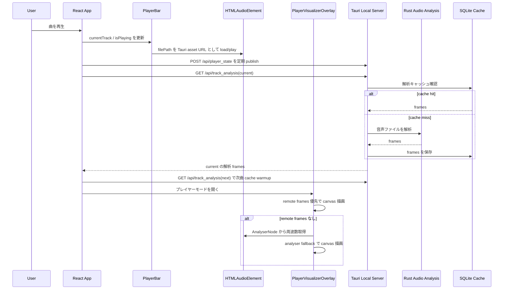
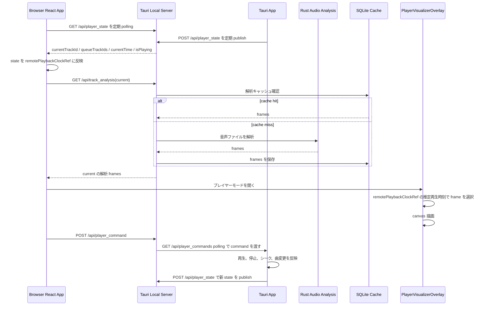

# ビジュアライザ設計書

この文書は、プレイヤービジュアライザの大きな修正時にデグレ確認するための仕様メモです。

対象は以下の 2 系統です。

- アプリ版: Tauri アプリ内で再生し、同じアプリ内のプレイヤーモードでビジュアライザを表示する
- ブラウザ版: Tauri のローカルサーバーにブラウザから接続し、アプリ側の再生状態と解析データを同期してビジュアライザを表示する

## 関連ファイル

- `src/App.tsx`
- `src/components/PlayerBar.tsx`
- `src/components/PlayerVisualizerOverlay.tsx`
- `src/lib/audioAnalysis.ts`
- `src/lib/backend.ts`
- `src-tauri/src/local_server.rs`
- `src-tauri/src/audio_analysis.rs`
- `src/config/appConfig.ts`

## 主要コンポーネント

### PlayerBar

再生対象の `<audio>` を保持し、再生、停止、シーク、音量、現在時刻を管理する。

Tauri アプリ版では、`getBackendMediaSrc(filePath)` でローカルファイルを Tauri asset URL に変換して `<audio>` に読み込む。

### PlayerVisualizerOverlay

プレイヤーモードの overlay。基本の `visualizer-canvas` に波、スペクトラム、サークル、山脈、DNA 螺旋、墨流し、VU メーターを Canvas 2D で描画する。オーロラは専用の `visualizer-aurora-canvas`、スターフィールドは専用の `visualizer-starfield-canvas` に Three.js/WebGL2 で描画し、WebGL 初期化に失敗した場合だけ基本 canvas の Canvas 2D 実装へ fallback する。ちびキャラオーケストラは通常ボタンに表示しない隠しモードとする。

DNA 螺旋は縦軸を時間履歴として扱う。一定間隔で低音から高音までを24帯域へ要約し、横線1本を1時点の周波数スナップショットとして追加する。新しい横線を下側、古い横線を上側へ配置し、各帯域の強度を線分の明度と太さへ反映する。横線の両端は逆位相で回転する2本のストランドへ接続し、二重螺旋としてアニメーションする。

山脈とオーロラは以下の視覚文法で区別する。

- 山脈: 横方向へ連続する面を画面下端へ閉じ、周波数値で稜線を上下させる
- オーロラ: 低域から高域までを5帯域へ要約し、横方向へ連続する色・エネルギーマップとして補間する。Three.js の `ShaderMaterial` は5フレームの履歴と FBM ノイズから、蛇行する発光上端、半透明の面光、多数の縦フィラメント、不規則に暗部へ溶ける下端を合成する。色は横方向のオーロラパレットだけでなく、上端の淡い色から中腹の基調色、下端の隣接色相へ移る縦グラデーションを持つ。`EffectComposer` と `UnrealBloomPass` はしきい値を超えた芯だけへ薄い発光を加え、面全体は白飛びさせない。Canvas 2D fallback は7フレームを古いものほど上奥へ薄くずらした残光として重ねる。矩形、台形、水平に揃った下端にはしない
- スターフィールド: 消失点から奥行きと角速度の異なる5層を手前へ放射する。各光跡は中心側の尾から外周側の鋭い先端へ伸び、距離が近いほど長く太くなる。微細な星間ダスト、彩度を保った色付きハロー、中心フレア、ノイズで途切れる薄い衝撃波リングを別レイヤーで合成する。周波数 bucket は32個ずつの完全な行へ分けて列読みし、`1,33,65,2,34,66…` 型の順序で32方向へ割り当てる。隣接周波数を角度方向へ散らした方向別エネルギーで、光跡の出現数、長さ、太さ、輝度を制御する。正の周波数差分は短い立ち上がり信号として光跡密度、中心光、衝撃波、bloom を強める。低域は加速度、中域はトンネル状の霞、高域は微細星と瞬きにも反映する。`EffectComposer` と `UnrealBloomPass` は高輝度の芯だけへ bloom を加え、黒背景とUIの可読性を残す。Canvas 2D fallback でも同じ散開順序、音量連動密度、消失点、長い光跡、中心光、衝撃波の視覚文法を保つ

モード選択と配色選択は独立したボタングループで表示する。配色は以下から選択する。

描画 Canvas、再生情報、歌詞、キュー、閉じるボタンは `visualizer-stage` 内に配置し、モード選択、配色選択、再生操作は stage の下にある独立した control dock へ配置する。Canvas は stage の境界を越えて control dock の背面へ描画しない。選択 UI は文字ラベルを表示せず、通常幅では9モードのアイコンを1×9、4配色のスウォッチを1×4の横一列へ配置し、その間を右向き矢印で接続する。幅680px以下では操作幅を収めるため3×3と2×2へ戻す。各アイコンボタンは accessible name と tooltip を持ち、選択状態を色だけでなく二重枠でも示す。選択 UI は上段、再生操作は最下段を維持する。control dock の外周余白、段間、ボタン寸法をコンパクトにし、歌詞とキューの配置を変えずに `visualizer-stage` の描画面積を優先する。

- オリジナル: 旧来の波、スペクトラム、サークルで使っていた時間変化する HSL 配色を再現する。その他のモードではシアン、ブルー、バイオレットを中心とした寒色パレットを使い、レインボーと区別する
- テーマ: `--primary`, `--accent`, `--foreground` から Canvas 用パレットを生成する
- アートワーク: 現在アルバムの画像を縮小サンプリングし、色相 bucket ごとの代表色を抽出する。画像を読み取れない場合はテーマ配色へ fallback する
- レインボー: ライム、グリーン、アクア、スカイブルー、ブルー、バイオレット、マゼンタ、ローズを左から右へ連続させる固定パレットを使う。オーロラでは全8色を順番どおり補間し、参考表示に近い広い虹色のカーテンを作る

オーロラの描画パラメータは配色別に分ける。オリジナル、テーマ、アートワークでは従来の面光、フィラメント密度、露出、bloom を維持する。レインボーでは細いストランドと不規則な下端を優先しつつ専用の露出と bloom を使い、白飛びを避けながら他配色よりわずかに明るくする。レインボーの周波数履歴は約48 ms間隔で更新し、5帯域のエネルギーを上端位置、ストランド長、輝度へ強く反映する。

選択した通常モードは `musical.visualizerMode`、配色は `musical.visualizerPalette` として `localStorage` に保存する。ちびキャラオーケストラは Chibi mode ボタンのダブルクリック/ダブルタップで切り替え、通常モードとしては保存しない。`prefers-reduced-motion: reduce` の場合、山脈、オーロラ、スターフィールド、DNA 螺旋、墨流しの移動速度や描画要素数を減らし、オーロラとスターフィールドの bloom 強度も抑える。スターフィールドでは光跡長と衝撃波の強さも下げる。

overlay 内の背景、アートワーク背景、装飾レイヤー、Canvas、vignette、操作 UI、closeボタンは、Chromium と Tauri WebView の stacking context 差で Canvas が親背景の背面へ回らないよう、すべて非負の `z-index` で順序を明示する。Canvas は背景レイヤーより前、vignette と操作 UI より後ろに配置し、Canvasと装飾レイヤーは `pointer-events: none` とする。closeボタンは操作UIより上の最前面へ置き、透明なcontentやCanvasにクリックを遮らせない。

描画データは以下の優先順で使う。

1. `audioAnalysisPacketRef.current.frames`: ローカルサーバーから取得した解析フレーム
2. `AnalyserNode`: アプリ内 `<audio>` から作る Web Audio analyser
3. idle 描画: 再生していない、または解析データがない場合の静止表示

Tauri/ブラウザ同期では remote 解析フレームが主経路。アプリ内では Web Audio analyser が fallback として機能する。

### ローカルサーバー

Tauri 起動時に `127.0.0.1:1422` 相当の local API を提供する。

主な endpoint:

- `GET /api/player_state`
- `POST /api/player_state`
- `POST /api/player_command`
- `GET /api/player_commands`
- `GET /api/track_analysis`
- `GET /api/audio_analysis_segment`
- `GET /api/media`

### 音声解析キャッシュ

`src-tauri/src/audio_analysis.rs` が音声ファイルを解析し、フレーム列を SQLite にキャッシュする。

キャッシュ DB はライブラリフォルダ配下の `.musical/audio_analysis.sqlite3`。

この保存先は意図的にライブラリフォルダへ寄せる。ライブラリを別の PC や
外部ディスクへ移動した場合でも、音源ファイルと解析キャッシュを一緒に持ち
運べるようにするため。アプリの user data / app data 配下へ集約すると、
端末ごとに再解析が必要になり、portable library としての扱いやすさが落ちる。

キャッシュキーは主に以下で決まる。

- track id
- file path
- file modified time
- stream hash
- analysis version

## アプリ版シーケンス

### アプリ版の期待動作

- 再生開始後、現在曲の解析データが生成される
- キューに次曲がある場合、次曲の解析キャッシュも warmup される
- プレイヤーモードを開くと `visualizer-canvas` が表示される
- 再生中は canvas の描画内容が時間経過で変化する
- 9 種類の通常モードをボタンで選択でき、モード変更後も再生状態を維持する
- Chibi mode ボタンのダブルクリック/ダブルタップでちびキャラオーケストラへ切り替わり、通常モードボタンを押すと解除される
- オリジナル、テーマ、アートワーク、レインボーの配色を選択できる
- モードと配色の選択がプレイヤーモードを閉じた後も復元される
- 解析が未完了または失敗しても、可能なら Web Audio analyser fallback で動く
- 再生停止中は idle 表示になる

## ブラウザ版シーケンス

### ブラウザ版の期待動作

- ブラウザは直接ローカル音声ファイルを再生しない
- ブラウザは `/api/player_state` からアプリ側の再生状態を受け取る
- ブラウザは `currentTrackId` と `isPlaying` が有効な時に `/api/track_analysis` を取得する
- remote clock がまだ未設定の初期瞬間でも、現在曲の解析ロードを不必要に中断しない
- `visualizer-canvas` は remote 解析 frames と推定再生時刻で動く
- ブラウザからの再生/停止/次曲などの操作は `/api/player_command` 経由でアプリへ渡る
- アプリが command を反映した後、`/api/player_state` でブラウザ側へ戻る

## 音声解析の注意点

`src-tauri/src/audio_analysis.rs` は Symphonia で音声を decode して FFT bucket を作る。

対応で注意する形式:

- 通常 MP3
- AAC / ALAC / FLAC / OGG / Vorbis / WAV
- `ID3 + RIFF/RMP3 + MP3 data` のような iTunes 由来の MP3 wrapper

`RIFF/RMP3` 形式では、ファイル先頭を wav と誤判定しないように `data` chunk offset 以降を MP3 stream として扱う。ID3v2 タグが64 KiBを超える場合も固定長の先頭検索には依存せず、header の syncsafe size からタグ終端へ直接 seek して `RIFF/RMP3` と `data` chunk を検出する。

ブラウザ版の解析取得がサーバー再起動などで一時的に失敗した場合は、現在曲が再生中であることを確認しながら 1 秒、3 秒、8 秒の上限付き backoff で再試行する。曲変更または停止時には予約済み再試行を破棄する。

## デグレ確認チェックリスト

大きな修正時は、最低限以下を確認する。

- `npm run build`
- `cargo check`
- `cargo test`
- `VITE_MOCK_DATA=true npx playwright test tests/e2e/library.spec.ts -g "player mode"`
- Tauri dev 起動時に `local server listening on 0.0.0.0:1422` が出る
- `GET http://127.0.0.1:1422/api/player_state` が JSON を返す
- 対象曲で `GET /api/track_analysis?...` が `200 OK` を返す
- 解析 frames に非ゼロ値が含まれる
- 64 KiBを超えるID3v2タグの後ろにRIFF/RMP3がある音源でも解析できる
- アプリ版でプレイヤーモードを開くと `.visualizer-canvas` が表示される
- 再生中の canvas hash が時間経過で変化する
- ブラウザ版で `/api/player_state` polling 後、`/api/track_analysis` request が発生する
- ブラウザ版で canvas hash が時間経過で変化する
- ブラウザ版で `.visualizer-canvas` の computed `z-index` が背景レイヤーより前の非負値になり、親 overlay の背景に隠れない
- ブラウザ版で overlay 全体の screenshot hash を時間を空けて比較し、Canvas 内部だけでなく最終合成結果も変化する
- 解析エラーが起きてもアプリ全体の再生、キュー、プレイヤーモードを壊さない

## よくある失敗パターン

### `/api/track_analysis` が 500

原因候補:

- 対象音声形式を Symphonia が decode できない
- ライブラリ DB の track id とリクエストの track id が一致していない
- ファイルが移動または削除されている
- 解析キャッシュ DB を作る `.musical` ディレクトリに書き込めない

確認:

- レスポンス本文の `audio.analysis.*` エラーを見る
- 対象ファイルを `file` や `afinfo` で確認する
- `cargo test` に形式検出の回帰テストを追加する

### ブラウザで canvas が静止する

原因候補:

- `/api/player_state` が `isPlaying: false` のまま
- `currentTrackId` が null
- ブラウザ側が `/api/track_analysis` を要求していない
- 解析 frames が空、または全ゼロに近い
- remote playback clock が曲変更後に古い track id のまま

確認:

- `GET /api/player_state`
- ブラウザ DevTools の Network で `/api/track_analysis`
- `.visualizer-canvas` の hash を 1 秒以上空けて比較

### アプリでは動くがブラウザでは動かない

原因候補:

- アプリ版は Web Audio analyser fallback で動いているが、ブラウザ版に remote frames が届いていない
- `/api/player_state` publish/polling が止まっている
- `/api/player_command` は届くが Tauri app 側が polling していない

確認:

- アプリ内再生中に `/api/player_state` が現在曲を返すか
- `/api/player_commands?after=0` に command が溜まり続けていないか
- Tauri app の command polling effect が起動しているか
