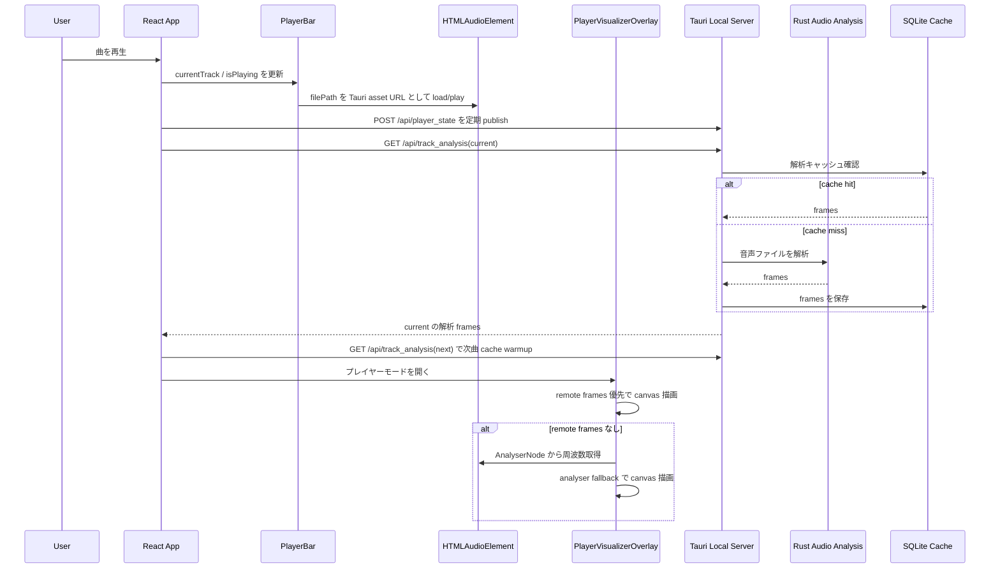
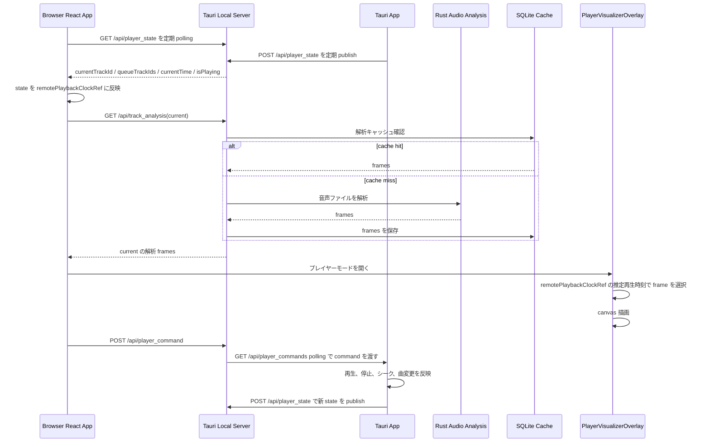

# ビジュアライザ設計書

この文書は、プレイヤービジュアライザの大きな修正時にデグレ確認するための仕様メモです。

対象は以下の 2 系統です。

- アプリ版: Tauri アプリ内で再生し、同じアプリ内のプレイヤーモードでビジュアライザを表示する
- ブラウザ版: Tauri のローカルサーバーにブラウザから接続し、アプリ側の再生状態と解析データを同期してビジュアライザを表示する

## 関連ファイル

- `src/App.tsx`
- `src/components/PlayerBar.tsx`
- `src/components/PlayerVisualizerOverlay.tsx`
- `src/lib/audioAnalysis.ts`
- `src/lib/backend.ts`
- `src-tauri/src/local_server.rs`
- `src-tauri/src/audio_analysis.rs`
- `src/config/appConfig.ts`

## 主要コンポーネント

### PlayerBar

再生対象の `<audio>` を保持し、再生、停止、シーク、音量、現在時刻を管理する。

Tauri アプリ版では、`getBackendMediaSrc(filePath)` でローカルファイルを Tauri asset URL に変換して `<audio>` に読み込む。

### PlayerVisualizerOverlay

プレイヤーモードの overlay。`visualizer-canvas` に波形、スペクトラム、サークルを描画する。

描画データは以下の優先順で使う。

1. `audioAnalysisPacketRef.current.frames`: ローカルサーバーから取得した解析フレーム
2. `AnalyserNode`: アプリ内 `<audio>` から作る Web Audio analyser
3. idle 描画: 再生していない、または解析データがない場合の静止表示

Tauri/ブラウザ同期では remote 解析フレームが主経路。アプリ内では Web Audio analyser が fallback として機能する。

### ローカルサーバー

Tauri 起動時に `127.0.0.1:1422` 相当の local API を提供する。

主な endpoint:

- `GET /api/player_state`
- `POST /api/player_state`
- `POST /api/player_command`
- `GET /api/player_commands`
- `GET /api/track_analysis`
- `GET /api/audio_analysis_segment`
- `GET /api/media`

### 音声解析キャッシュ

`src-tauri/src/audio_analysis.rs` が音声ファイルを解析し、フレーム列を SQLite にキャッシュする。

キャッシュ DB はライブラリフォルダ配下の `.musical/audio_analysis.sqlite3`。

キャッシュキーは主に以下で決まる。

- track id
- file path
- file modified time
- stream hash
- analysis version

## アプリ版シーケンス

### アプリ版の期待動作

- 再生開始後、現在曲の解析データが生成される
- キューに次曲がある場合、次曲の解析キャッシュも warmup される
- プレイヤーモードを開くと `visualizer-canvas` が表示される
- 再生中は canvas の描画内容が時間経過で変化する
- 解析が未完了または失敗しても、可能なら Web Audio analyser fallback で動く
- 再生停止中は idle 表示になる

## ブラウザ版シーケンス

### ブラウザ版の期待動作

- ブラウザは直接ローカル音声ファイルを再生しない
- ブラウザは `/api/player_state` からアプリ側の再生状態を受け取る
- ブラウザは `currentTrackId` と `isPlaying` が有効な時に `/api/track_analysis` を取得する
- remote clock がまだ未設定の初期瞬間でも、現在曲の解析ロードを不必要に中断しない
- `visualizer-canvas` は remote 解析 frames と推定再生時刻で動く
- ブラウザからの再生/停止/次曲などの操作は `/api/player_command` 経由でアプリへ渡る
- アプリが command を反映した後、`/api/player_state` でブラウザ側へ戻る

## 音声解析の注意点

`src-tauri/src/audio_analysis.rs` は Symphonia で音声を decode して FFT bucket を作る。

対応で注意する形式:

- 通常 MP3
- AAC / ALAC / FLAC / OGG / Vorbis / WAV
- `ID3 + RIFF/RMP3 + MP3 data` のような iTunes 由来の MP3 wrapper

`RIFF/RMP3` 形式では、ファイル先頭を wav と誤判定しないように `data` chunk offset 以降を MP3 stream として扱う。

## デグレ確認チェックリスト

大きな修正時は、最低限以下を確認する。

- `npm run build`
- `cargo check`
- `cargo test`
- `VITE_MOCK_DATA=true npx playwright test tests/e2e/library.spec.ts -g "player mode"`
- Tauri dev 起動時に `local server listening on 0.0.0.0:1422` が出る
- `GET http://127.0.0.1:1422/api/player_state` が JSON を返す
- 対象曲で `GET /api/track_analysis?...` が `200 OK` を返す
- 解析 frames に非ゼロ値が含まれる
- アプリ版でプレイヤーモードを開くと `.visualizer-canvas` が表示される
- 再生中の canvas hash が時間経過で変化する
- ブラウザ版で `/api/player_state` polling 後、`/api/track_analysis` request が発生する
- ブラウザ版で canvas hash が時間経過で変化する
- 解析エラーが起きてもアプリ全体の再生、キュー、プレイヤーモードを壊さない

## よくある失敗パターン

### `/api/track_analysis` が 500

原因候補:

- 対象音声形式を Symphonia が decode できない
- ライブラリ DB の track id とリクエストの track id が一致していない
- ファイルが移動または削除されている
- 解析キャッシュ DB を作る `.musical` ディレクトリに書き込めない

確認:

- レスポンス本文の `audio.analysis.*` エラーを見る
- 対象ファイルを `file` や `afinfo` で確認する
- `cargo test` に形式検出の回帰テストを追加する

### ブラウザで canvas が静止する

原因候補:

- `/api/player_state` が `isPlaying: false` のまま
- `currentTrackId` が null
- ブラウザ側が `/api/track_analysis` を要求していない
- 解析 frames が空、または全ゼロに近い
- remote playback clock が曲変更後に古い track id のまま

確認:

- `GET /api/player_state`
- ブラウザ DevTools の Network で `/api/track_analysis`
- `.visualizer-canvas` の hash を 1 秒以上空けて比較

### アプリでは動くがブラウザでは動かない

原因候補:

- アプリ版は Web Audio analyser fallback で動いているが、ブラウザ版に remote frames が届いていない
- `/api/player_state` publish/polling が止まっている
- `/api/player_command` は届くが Tauri app 側が polling していない

確認:

- アプリ内再生中に `/api/player_state` が現在曲を返すか
- `/api/player_commands?after=0` に command が溜まり続けていないか
- Tauri app の command polling effect が起動しているか

